In this section, we analyze brand performance between 2015 to 2018 to identify trends and patterns that will enable us to develop marketing and operations strategies in a contemporary business environment.

**Metrics**
Revenue Trends - Orders revenue, number of orders, and Average order Value (AVO)  
Product Performance - analyze product and brand lines  
Regional results - evaluate regional demand and brand performance to identify areas for improvement 

**Tools**
Power BI and Dax
**<b>Summary </b>**
 
Year over Year Revenue
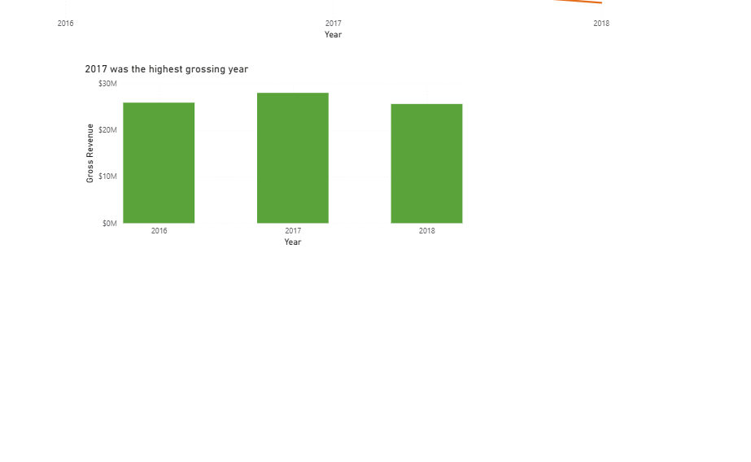
 

Year over Year order counts
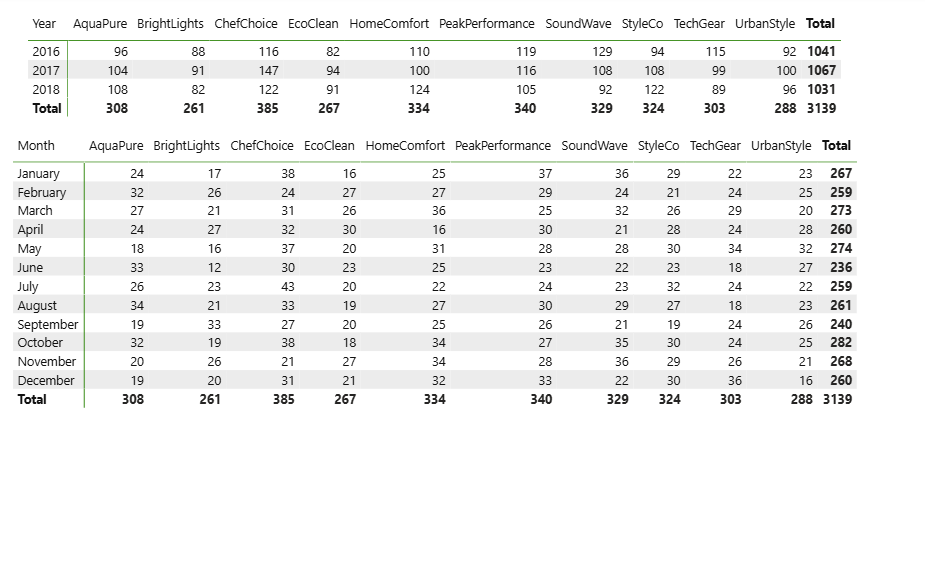
 
Overall Revenue by Brand

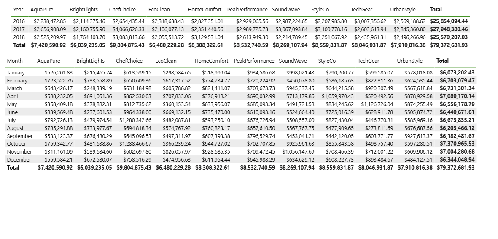
 

Revenue by Brand Report
 

 

Revenue Performance Report
 
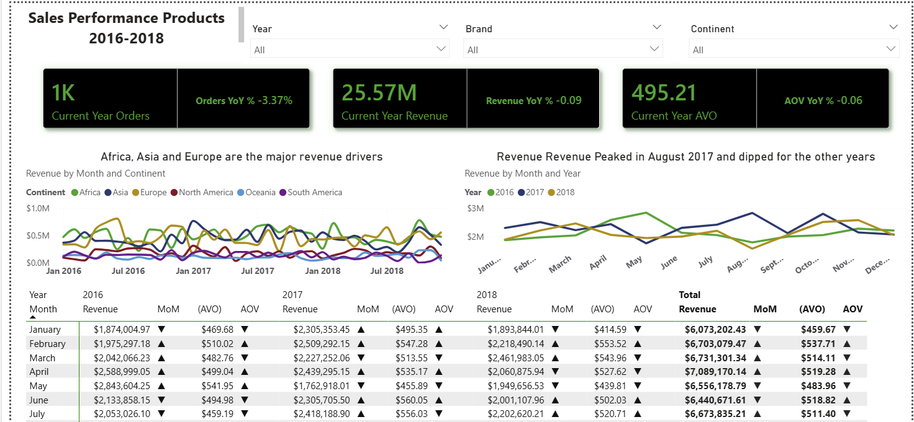
 

May 2017 Decline
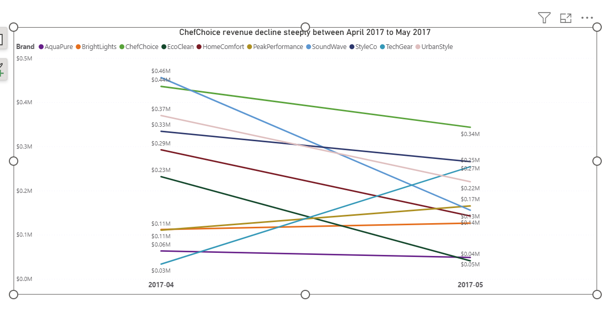
 

August 2018 Decline
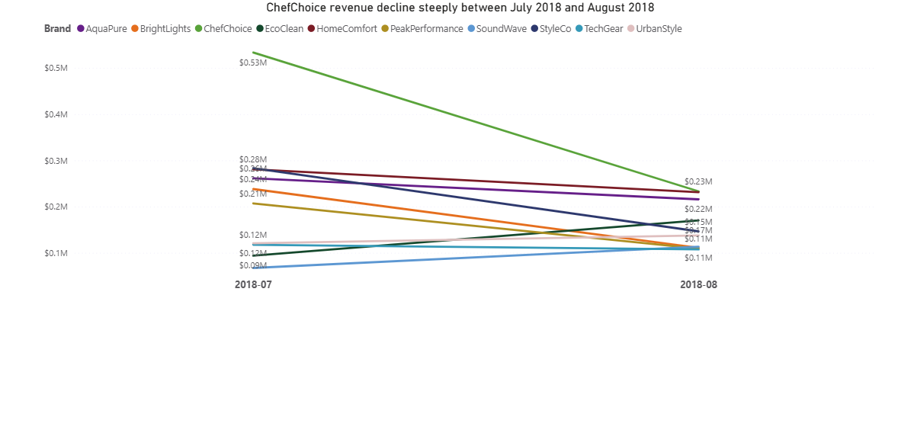
 

**Revenue Growth and Peak Performance** 
&nbsp;&nbsp;&nbsp;&nbsp;- 2017 was the strongest year with revenue of 28.9M, with revenue fluctuating throughtout the years. Revenue were at an all time high in May 2016 (~2.8M), but decline every month after, followed by a slight rise in November 2016, Increasing slowly in between January 2017 to April, but had a sharpe decline again in May 2017 and rising sharply again in August 2017, fluctuated between 2M in 2018, but had a sharp decline in Aug 2018 reaching ~1.6M  
&nbsp;&nbsp;&nbsp;&nbsp;- ChefChoice ,SqoundWave , StyleCo , and UrbanStyle (370K->220k) were the key drivers of the dip in (April to May) 2017 with revenue drops of 436K to 343K, 456K to 156k, and 334K to 266K respectively. In July to August, 2018 the major contributors to the decline in revenue were Chefchoice (534 to 233), BrightLights(238 to 111), PeakPerformance(207 to 109), StyleCo(283 to 146). 
&nbsp;&nbsp;&nbsp;&nbsp;- Africa, Asia, and Europe are the regions revenue where most of our revenue are generated from. 
&nbsp;&nbsp;&nbsp;&nbsp;- All regions revenue fluctuated during the assessment period, but Africa, Asia, and Europe all peaked simulataneously in Oct 2018. They also had a simultaneous decline in September 2017 indicating global/macro trends. 
&nbsp;&nbsp;&nbsp;&nbsp;- ChefChoice is our all-time best performing brand with revenue totalling $9.8M, but experienced a sharp decline from 2017 to 2018 overall. 
&nbsp;&nbsp;&nbsp;&nbsp;- ChefChoice declines occurs in the region of Africa, Europe, and Asia. Europe mainly between Nov 2017 and May 2018, Africa Aug 2017 and Jan 2018, and Asia Nov 2017 to May 2018. . 

**Order Count** 
&nbsp;&nbsp;&nbsp;&nbsp;- Order counts follow revenue. Like revenue, orders fluctuates during the period with no major dips with the lowest total orders of 9.6M in 2014 
&nbsp;&nbsp;&nbsp;&nbsp;- Total order dropped by 8% between 2013 to 2014 
&nbsp;&nbsp;&nbsp;&nbsp;- While 2002, 2009, 2015 have approximately the same amount of total orders, the annual revenue is not the same which would indicated that order values were higher in 2002 than in the other years. 

Revenue by Country

**Product Segment and Country performance** 
&nbsp;&nbsp;&nbsp;&nbsp;- Every country contributes less than 1% of revenue;however, Tonga and Turkey contibution is less than 0.3% 
&nbsp;&nbsp;&nbsp;&nbsp;- The low performing product segment revenue is less than half of the other two segments, but has the most customers purchases which would indicate most customers buy the cheaper products. 

Dataset Structure and ERD (Entity Relation Diagram)
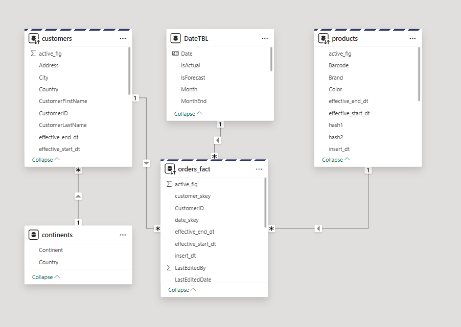
 

**Orders and Average Order Value (AOV)** 

Order by month
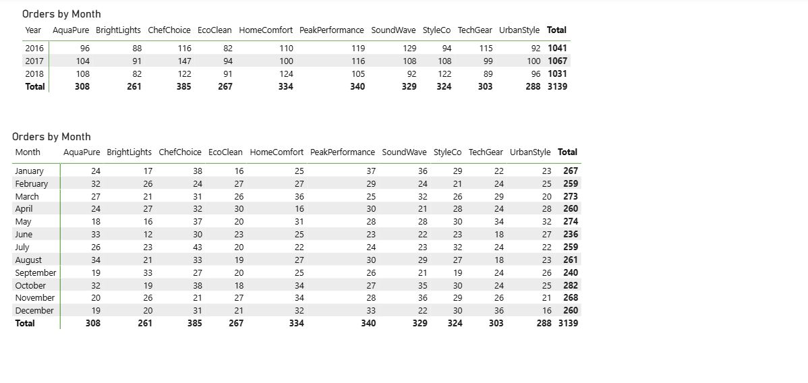
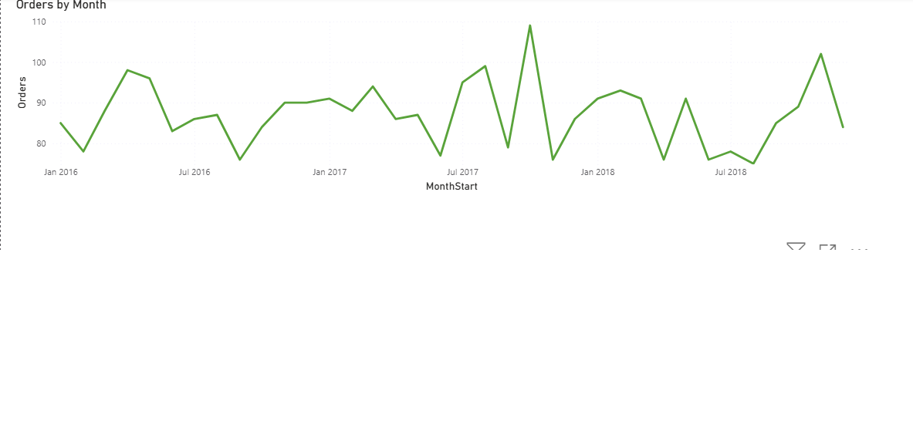
 
Monthly orders top 3 brands
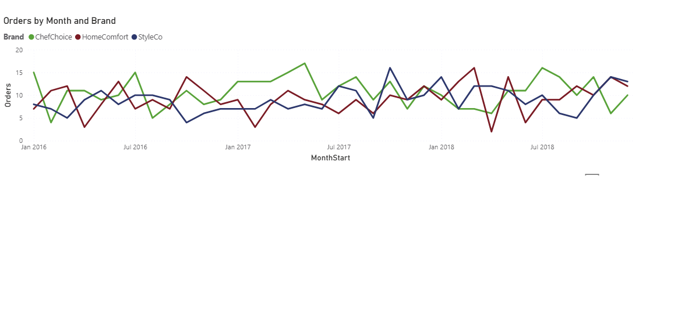

AOV by month
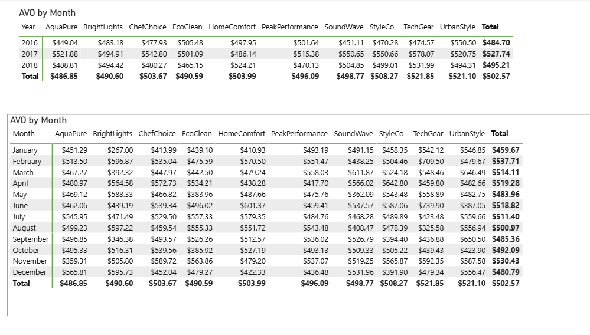
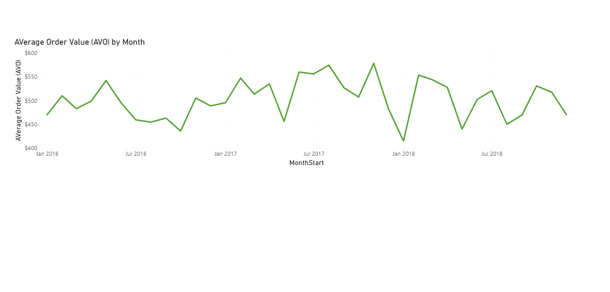
 
Monthly orders top 3 brands
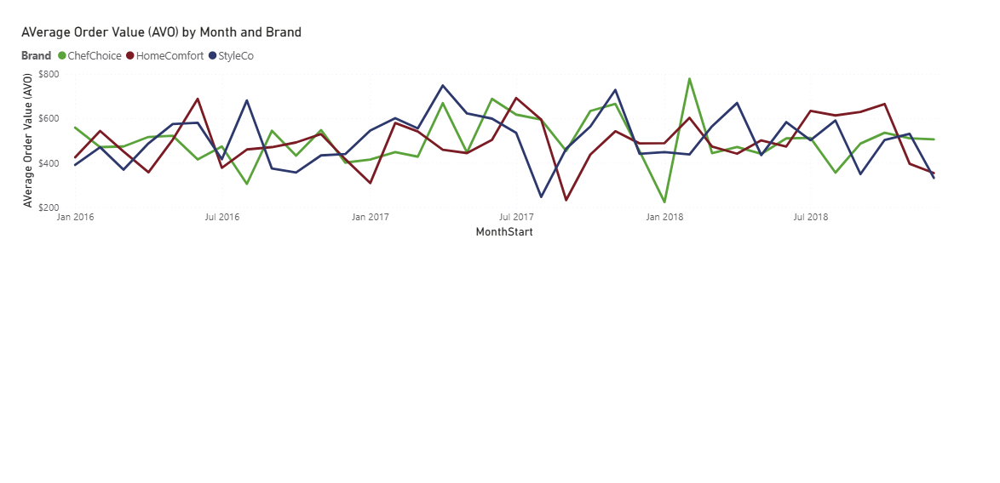

Orders by Region
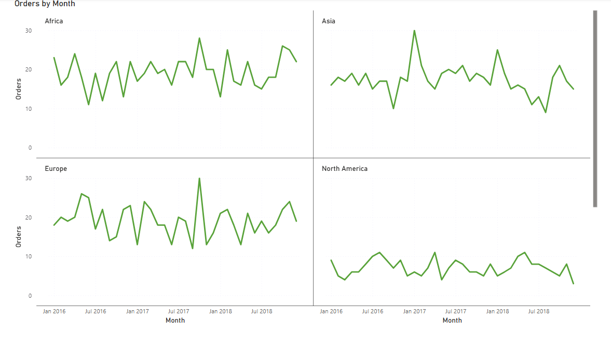

AOV by Region

&nbsp;&nbsp;&nbsp;&nbsp;- Total order across 2016-2018 is 3,139, ranging in yearly orders from 1,031 to 1,067. Orders dip from 1067 in 2017 to 1031 in 2018 
&nbsp;&nbsp;&nbsp;&nbsp;- Best performing brand is ChefChoice (385 Orders), worst performing is BrightLights (261 orders) 
&nbsp;&nbsp;&nbsp;&nbsp;- October is our overall best performing month in the period. Maybe related to holiday promotions at that time - Thanksgiving , holloween, early-good Friday 
&nbsp;&nbsp;&nbsp;&nbsp;- Chefchoice, HomeComfort, StyleCo (top 3 brands by orders) had a simultaneous dip in Sep 2017 in both orders and average order value 
&nbsp;&nbsp;&nbsp;&nbsp;- Chefchoice, HomeComfort, StyleCo (top 3 brands by orders) had a simultaneous dip in November 2017, but contrasting rise in AVO in Nov 2017 - Likely due to purchasing of more expensive products over cheaper ones. 
&nbsp;&nbsp;&nbsp;&nbsp;- Oct 2017, saw a spike in Orders in Africa and Europe over the previous month 
&nbsp;&nbsp;&nbsp;&nbsp;- Oct 2017, we saw a rise of AOV in Oceania and South American over the previous month - indicating a sale of higher value products 

**<b>Recommendations </b>** 
&nbsp;&nbsp;&nbsp;&nbsp;- Finance and analytics teams should investigate the main drivers for low revenue in 6 and 2018 - which brands, products, or region. 
&nbsp;&nbsp;&nbsp;&nbsp;- Marketing team should push more promotions and marketing strategies for mid and high performing brands in October, especially in Africa and Europe. 
&nbsp;&nbsp;&nbsp;&nbsp;- Marketing team should developed focused targeted promotions for products of high value brands in Oceania and South America in October for the holidays.  

**Caveats and Assumptions** 

- The LastEditWhen field is the order date and time of products
