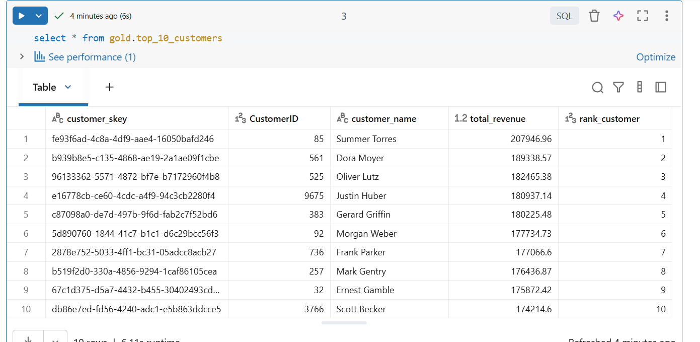
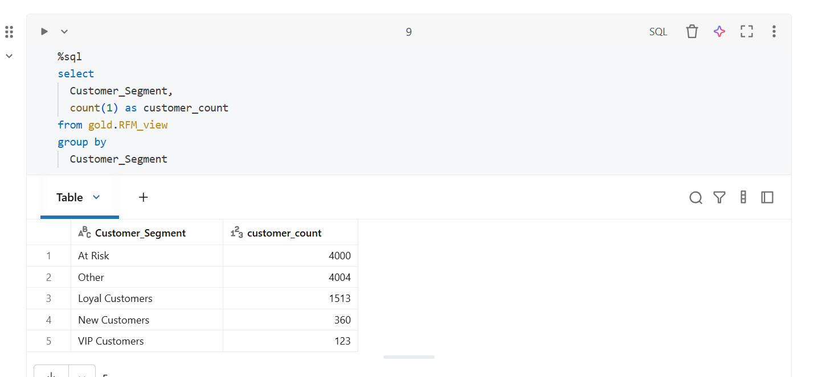
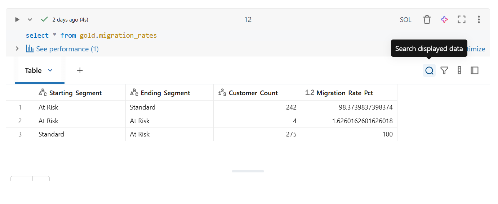
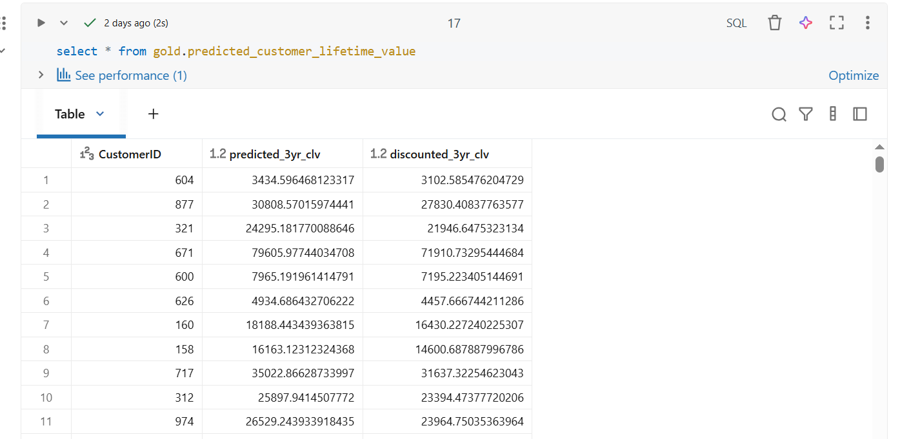
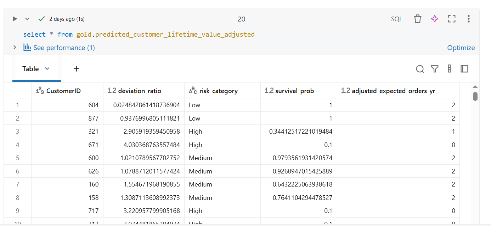
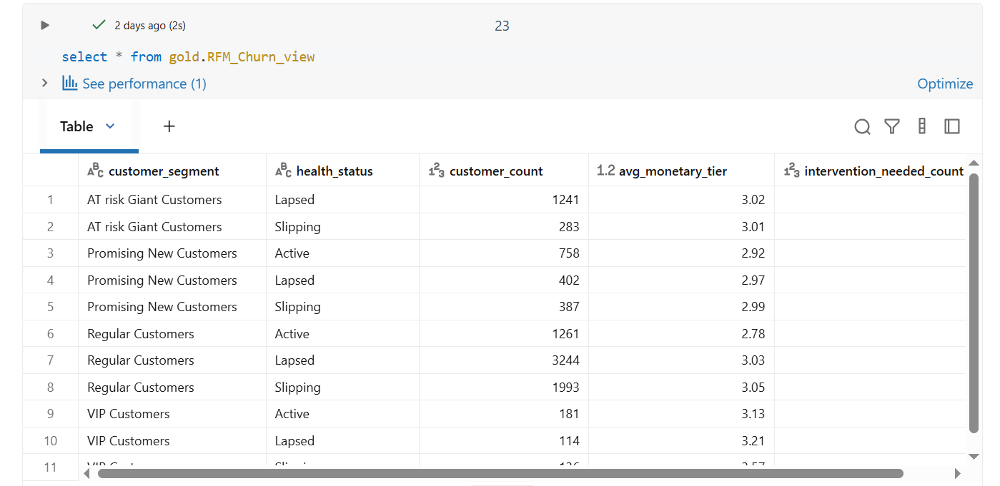

In this section we analyse the customers behavior to detect any potential slippage and to develop targeted retention strategies.

<h3> Identify top 10 customers by revenue </h3>
```
%sql
-- Find the top 10 customers who have generated the highest revenue
create or replace view gold.top_10_customers as
select *
from
(
  SELECT 
      customer_skey,
      c.CustomerID,
      concat(c.CustomerFirstName,' ',c.CustomerLastName) as customer_name,
      round(SUM(of.Quantity * of.UnitPrice),2) AS total_revenue,
      RANK() OVER (ORDER BY SUM(of.Quantity * of.UnitPrice) DESC) AS rank_customer
  FROM gold.orders_fact of
  LEFT JOIN gold.customers c
      ON c.CustomerID = of.CustomerID
  GROUP BY 
      customer_skey,
      c.CustomerID,
      concat(c.CustomerFirstName,' ',c.CustomerLastName) 
  ORDER BY total_revenue DESC
)
where 
  rank_customer <= 10
```


<h3> Part-to-Whole Analysis </h3>
<h4>Purpose: </h4>
    - To compare performance or metrics across dimensions or time periods.
    - To evaluate differences between categories.
    - Useful for A/B testing or regional comparisons.

```
%sql
create or replace view gold.customer_segment_part_to_Whole as
-- Which customer segments contribute the most to overall revenue?
WITH segment_revenue AS (
    SELECT
        customer_segment,
        round(SUM(total_revenue),2) AS total_revenue,
        COUNT(total_products) AS total_products,
        round(SUM(avg_monthly_spend),2) AS total_avg_monthly_spend
    FROM gold.customer_segment
    GROUP BY customer_segment
)
SELECT
    customer_segment,
    total_products,
    total_revenue,
    total_avg_monthly_spend,
    ROUND((CAST(total_revenue AS FLOAT) / SUM(total_revenue) OVER ()) * 100, 2) AS percentage_of_total,
    RANK() OVER (ORDER BY total_revenue DESC) AS rank_customer
FROM segment_revenue;
```


<h3> RFM analysis (Recency, Frequency, and Monetary) </h3>
<h4> Purpose: </h4>
    - Customer segmentation technique used to evaluate Recency, Frequency, and Monetary value.
    - Identifying your most valuable customers versus those at risk of churning.

```

%sql
create view gold.RFM_view as
WITH RawData AS (
    /*
    Select columns needed for analyses
    */
    SELECT
        CustomerID,
        DATEDIFF(day, MAX(LastEditedDate), GETDATE()) AS Recency, -- Time since last purchase
        COUNT(OrderID) AS Frequency, -- Total orders
        round(SUM(unitprice * Quantity),2) AS Monetary -- Total spend
    FROM gold.orders_fact
    GROUP BY CustomerID
),
RankedData AS (
    /*
    Assign Scoring (Quintiles)
      •	Recency: Lower values (more recent) get higher scores (rank by Recency DESC).
      •	Frequency/Monetary: Higher values get higher scores (rank by ASC).
    */
    SELECT
        CustomerID,
        NTILE(5) OVER (ORDER BY Recency DESC) AS R_Score,
        NTILE(5) OVER (ORDER BY Frequency ASC) AS F_Score,
        NTILE(5) OVER (ORDER BY Monetary ASC) AS M_Score
    from
      RawData

)
SELECT
    /*
      Segment Your Customers
    */
    CustomerID,
    CONCAT(R_Score, F_Score, M_Score) AS RFM_Cell, -- Combined 3-digit score
    CASE
        WHEN R_Score = 5 AND F_Score = 5 AND M_Score = 5 THEN 'VIP Customers'
        WHEN R_Score >= 4 AND F_Score >= 4 THEN 'Loyal Customers'
        WHEN R_Score = 5 AND F_Score = 1 THEN 'New Customers'
        WHEN R_Score <= 2 THEN 'At Risk'
        ELSE 'Other'
    END AS Customer_Segment
FROM RankedData;


```



<h3> Migration Rates <h3>
<h4> Purpose: </h4>
    - Compare a customer's segment at two different points in time (The flow of customers).

```
%sql
create or replace view gold.migration_rates as
  with base_query as(
    select
      of.OrderID,
      of.LastEditedWhen,
      c.CustomerID,
      DATEDIFF(day, MAX(of.LastEditedDate), GETDATE()) AS Recency
    from
      gold.dim_date dd
    join
      gold.orders_fact of
    on of.LastEditedDate = dd.date
    left join
      gold.customers c
    on of.CustomerID = c.CustomerID
    where
      c.active_flg = 1
    group by
      of.OrderID,
      of.LastEditedWhen,
      c.CustomerID
  ), customer_orders as (
  select
    CustomerID,
    Recency,
    count(distinct OrderID) as total_orders,
    max(LastEditedWhen) as last_order_date
  from
    base_query
  group by
    CustomerID,
    Recency
  ),
  MaxDateCTE as (
    select MAX(LastEditedWhen) AS MaxDate
    from gold.orders_fact
    where year(LastEditedWhen) = 2018
  )
  ,period_1 as (
    select c.*
    from
      customer_orders c
    cross join
      MaxDateCTE M
    where c.last_order_date >= DATEADD(month, -6, M.MaxDate) and c.last_order_date < DATEADD(month, -3, M.MaxDate)
   ),
   period_2 as (
    select c.*
    from
      customer_orders c
    cross join
      MaxDateCTE M
    where c.last_order_date >= DATEADD(month, -3, M.MaxDate) and c.last_order_date <= M.MaxDate
   ),
   Segment_History AS (
    SELECT
        coalesce(p1.CustomerID, p2.CustomerID) AS CustomerID,
        -- Period 1: e.g., 6 months ago to 3 months ago
        CASE
            WHEN p1.recency <= 30 AND p1.Total_Orders > 5 THEN 'Loyal'
            WHEN p1.recency > 90 THEN 'At Risk'
            ELSE 'Regular'
        END AS Segment_P1,
        -- Period 2: e.g., the last 3 months
        CASE
        WHEN p2.recency <= 30 AND p2.Total_Orders > 5 THEN 'Loyal'
            WHEN p2.recency > 90 THEN 'At Risk'
            ELSE 'Regular'
        END AS Segment_P2
    FROM period_1 AS p1
    FULL JOIN period_2 AS p2 ON p1.CustomerID = p2.CustomerID
),
Migration_Counts AS (
    SELECT
        Segment_P1,
        Segment_P2,
        COUNT(CustomerID) AS Customer_Count
    FROM Segment_History
    GROUP BY Segment_P1, Segment_P2
)
SELECT
    Segment_P1 AS Starting_Segment,
    Segment_P2 AS Ending_Segment,
    Customer_Count,
    -- Calculation: (Moved to B) / (Total who started in A)
    CAST(Customer_Count AS FLOAT) /
        SUM(Customer_Count) OVER(PARTITION BY Segment_P1) * 100 AS Migration_Rate_Pct
FROM Migration_Counts
ORDER BY Starting_Segment, Migration_Rate_Pct DESC

;;
```



<h3> Predictive Customer Lifetime Value (CLV) forecasting <h3>
<h4> Purpose: <h4>
    - Calculate the expected future revenue a customer will generate based on their past behavior.

```

create or replace view gold.predicted_customer_lifetime_value as
WITH Customer_Base AS (
    SELECT
      /*
      Select main columns for analyses
      */
        CustomerID,
        MIN(LastEditedWhen) as first_purchase,
        MAX(LastEditedWhen) as last_purchase,
        COUNT(DISTINCT OrderID) as total_orders,
        round(SUM(UnitPrice * Quantity),2) as total_revenue,
        round(AVG(UnitPrice * Quantity),2) as avg_order_value -- Average Purchase Value (APV)
    FROM gold.orders_fact
    GROUP BY CustomerID
),
Ratios AS (
  /*
    Calculate Key Prediction Ratios
    -	APFR: How many times they buy in a given time unit (e.g., per year).
    -	Lifespan: The duration in years between their first and most recent purchase

    NB To forecast, you need the Average Purchase Frequency Rate (APFR) and the Average Customer Lifespan (ACL).

  */
    SELECT
        CustomerID,
        avg_order_value,
        -- Frequency: orders per year
        (CAST(total_orders AS FLOAT) /
         NULLIF(DATEDIFF(day, first_purchase, last_purchase), 0) * 365) AS annual_frequency,
        -- Lifespan: total years active
        DATEDIFF(day, first_purchase, last_purchase) / 365.0 AS current_lifespan_years
    FROM Customer_Base
)SELECT
  /*
    Forecast Future CLV
  */
    CustomerID,
    -- Simple Forecast: (Avg Order Value * Annual Frequency) * Predicted Future Years
    (avg_order_value * annual_frequency) * 3 AS predicted_3yr_clv,

    -- Discounted Forecast: accounting for a 10% annual churn probability
    (avg_order_value * annual_frequency) * (1 - POWER(0.9, 3)) / (1 - 0.9) AS discounted_3yr_clv
FROM Ratios;
```



<h3> Refined Lifetime Value (CLV) forecasts </h3>
<h4> Adjust the "predicted future years" based on the probability that a customer is still active </h4>
<h4> A Churn Risk Score acts as a multiplier: if the risk is high (e.g., 90%), your CLV forecast should drop significantly </h4>

```
create or replace view gold.predicted_customer_lifetime_value_adjusted as
WITH Customer_Behavior AS (
  /*
    Identify Risk Indicators
    We calculate indicators that signal a fading relationship, specifically Recency vs. Average Gap. If a customer usually buys every 30 days but hasn't bought in 60, their risk is rising

  */
    SELECT
      /*
      Calculate key indicators
      */
        CustomerID,
        DATEDIFF(day, MAX(LastEditedWhen), GETDATE()) AS days_since_last_purchase,
        COUNT(OrderID) AS total_orders,
        -- Calculate the average time between purchases (Inter-purchase Time)
        DATEDIFF(day, MIN(LastEditedWhen), MAX(LastEditedWhen)) / NULLIF(COUNT(OrderID) - 1, 0) AS avg_purchase_gap
    FROM gold.orders_fact
    GROUP BY CustomerID
),
Risk_Scoring AS (
  /*
    Calculate the Churn Risk Score
    We use a ratio of Current Silence / Typical Gap.
    -	Score 0-1.0: Behavior is normal.
    -	Score > 1.5: Customer is "overdue" and likely drifting.
    -	Score > 3.0: High probability of churn.

  */
    SELECT
        *,
        CASE
            WHEN avg_purchase_gap IS NULL THEN 0.5 -- New customers (neutral risk)
            ELSE (CAST(days_since_last_purchase AS FLOAT) / NULLIF(avg_purchase_gap, 0))
        END AS deviation_ratio
    FROM Customer_Behavior
)
SELECT
/*
  Refine the CLV Forecast
  - Integrate the risk score into your prediction
*/
    CustomerID,
    deviation_ratio,
    CASE
        WHEN deviation_ratio < 1.0 THEN 'Low'
        WHEN deviation_ratio BETWEEN 1.0 AND 2.0 THEN 'Medium'
        ELSE 'High'
    END AS risk_category,
    -- Survival Probability: The higher the deviation, the lower the probability
    CASE
        WHEN deviation_ratio <= 1.0 THEN 1.0  -- 100% likely to stay
        WHEN deviation_ratio > 3.0 THEN 0.1   -- 10% likely to stay
        ELSE (1 / deviation_ratio)            -- Sliding scale
    END AS survival_prob,
    -- Refined CLV: (Historical Annual Value) * Survival Probability
    round((total_orders * survival_prob)) AS adjusted_expected_orders_yr
FROM Risk_Scoring;
/*
Note
Why this Refines Forecasts
-	Avoids Over-Optimism: Without this, a "VIP Customer" who hasn't bought in 2 years would still show a massive predicted CLV.
-	Triggers Intervention: You can export customers where risk_category = 'Medium' directly to a Marketing Automation tool  for a "Win-back" campaign.
-	Dynamic Budgeting: It allows finance teams to see a "Risk-Adjusted" revenue pipeline.


*/

```



<h3> Merge behavioral segments with predictive risk </h3>
<h4> Purpose: </h4>
  - Combines RFM Model and your Churn Risk Model into a single reporting view

```
CREATE OR REPLACE VIEW gold.RFM_Churn_view AS
WITH RawData AS (
    /*
    Select columns needed for analyses
    */
    SELECT
        CustomerID,
        DATEDIFF(day, MAX(LastEditedDate), GETDATE()) AS Recency, -- Time since last purchase
        COUNT(OrderID) AS Frequency, -- Total orders
        round(SUM(unitprice * Quantity),2) AS Monetary, -- Total spend,
        DATEDIFF(day, MAX(LastEditedWhen), GETDATE()) AS days_since_last_purchase,
        -- Calculate the average time between purchases (Inter-purchase Time)
        DATEDIFF(day, MIN(LastEditedWhen), MAX(LastEditedWhen)) / NULLIF(COUNT(OrderID) - 1, 0) AS avg_purchase_gap
    FROM gold.orders_fact
    GROUP BY CustomerID
),
RankedData AS (
    /*
    Assign Scoring (Quintiles)
      •	Recency: Lower values (more recent) get higher scores (rank by Recency DESC).
      •	Frequency/Monetary: Higher values get higher scores (rank by ASC).
    */
    SELECT
        CustomerID,
        NTILE(5) OVER (ORDER BY Recency DESC) AS R_Score,
        NTILE(5) OVER (ORDER BY Frequency ASC) AS F_Score,
        NTILE(5) OVER (ORDER BY Monetary ASC) AS M_Score
    from
      RawData

),
RFM_DATA as (
  SELECT
      /*
        Segment Your Customers
      */
      CustomerID,
      R_Score, F_Score, M_Score,
      CASE
          WHEN R_Score > 4 AND F_Score > 4  THEN 'VIP Customers'
          WHEN R_Score <= 2 AND F_Score >= 4 THEN 'AT risk Giant Customers'
          WHEN R_Score >= 4 AND F_Score <= 2 THEN 'Promising New Customers'
          ELSE 'Regular Customers'
      END AS Customer_Segment
  FROM RankedData
),
Risk_Scoring AS (
  /*
    Calculate the Churn Risk Score
    We use a ratio of Current Silence / Typical Gap.
    -	Score 0-1.0: Behavior is normal.
    -	Score > 1.5: Customer is "overdue" and likely drifting.
    -	Score > 3.0: High probability of churn.

  */
    SELECT
        *,
        CASE
            WHEN avg_purchase_gap IS NULL THEN 0.5 -- New customers (neutral risk)
            ELSE (CAST(days_since_last_purchase AS FLOAT) / NULLIF(avg_purchase_gap, 0))
        END AS deviation_ratio
    FROM RawData
),
Risk_Data AS (
    SELECT
        CustomerID,
        deviation_ratio,
        CASE
            WHEN deviation_ratio <= 1.0 THEN 'Active'
            WHEN deviation_ratio BETWEEN 1.1 AND 2.5 THEN 'Slipping'
            ELSE 'Lapsed'
        END AS health_status
    FROM Risk_Scoring -- Calculated in previous steps
)
SELECT
    r.customer_segment,
    k.health_status,
    COUNT(r.CustomerID) AS customer_count,
    ROUND(AVG(r.M_Score), 2) AS avg_monetary_tier,
    -- Actionable Metric: Total Revenue at Stake
    SUM(CASE WHEN k.health_status = 'Slipping' THEN 1 ELSE 0 END) AS intervention_needed_count
FROM RFM_Data r
JOIN Risk_Data k ON r.CustomerID = k.CustomerID
GROUP BY 1, 2
ORDER BY 1, 2;

```


