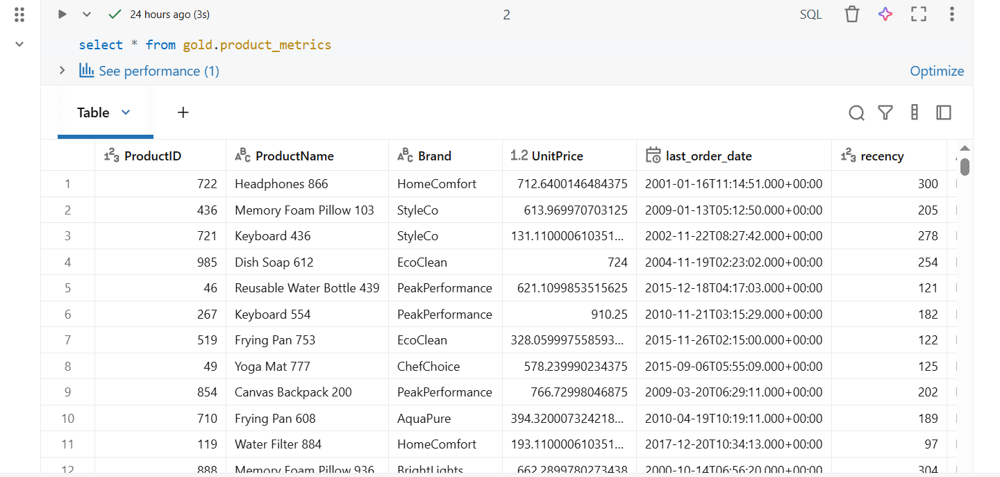
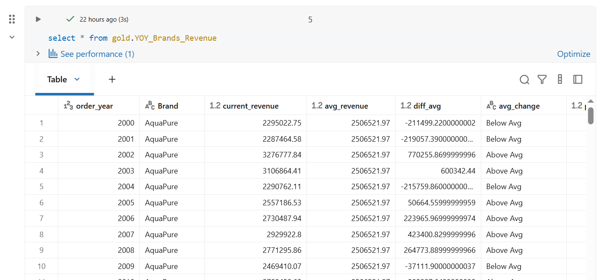
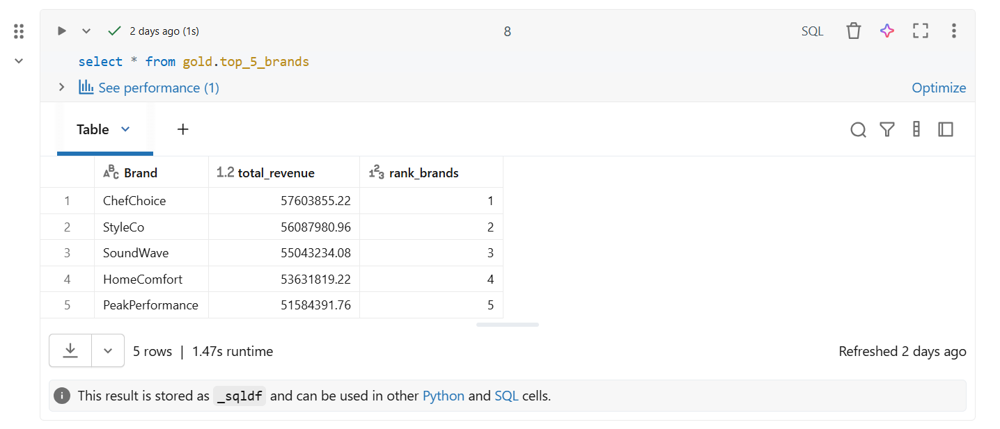
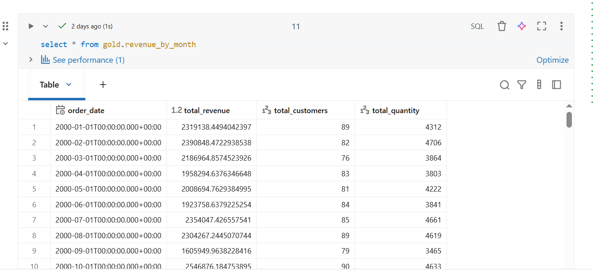
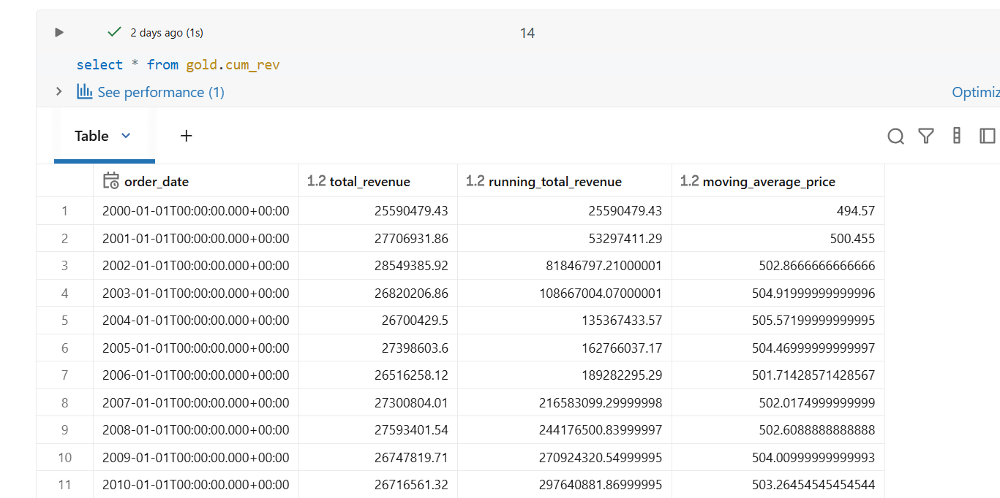
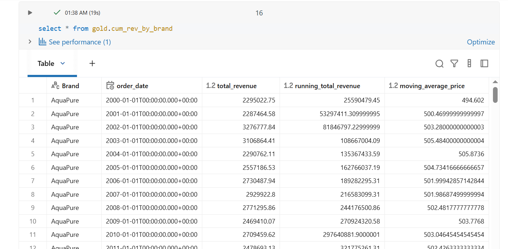
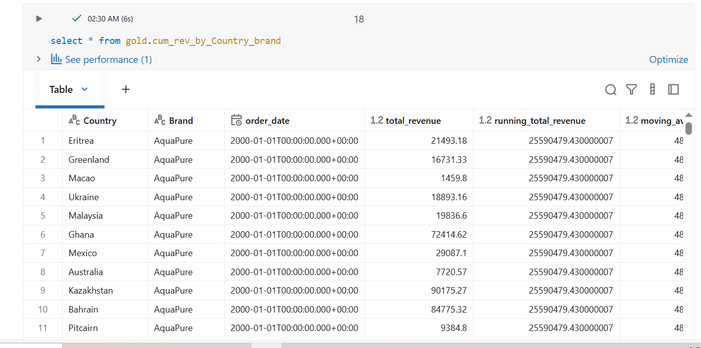
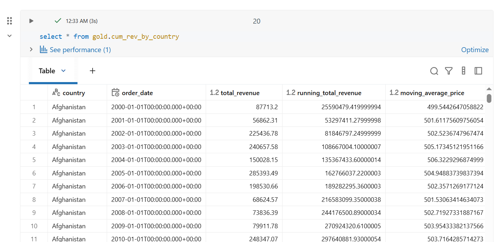
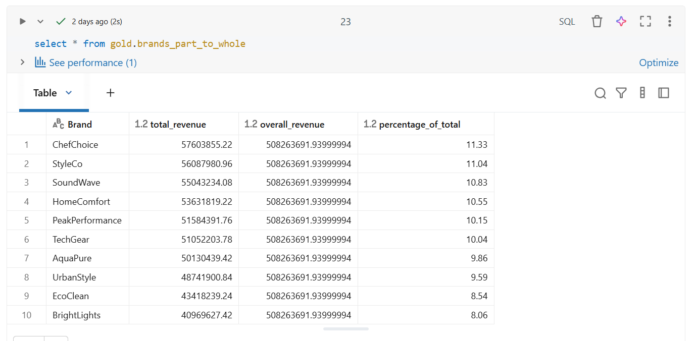
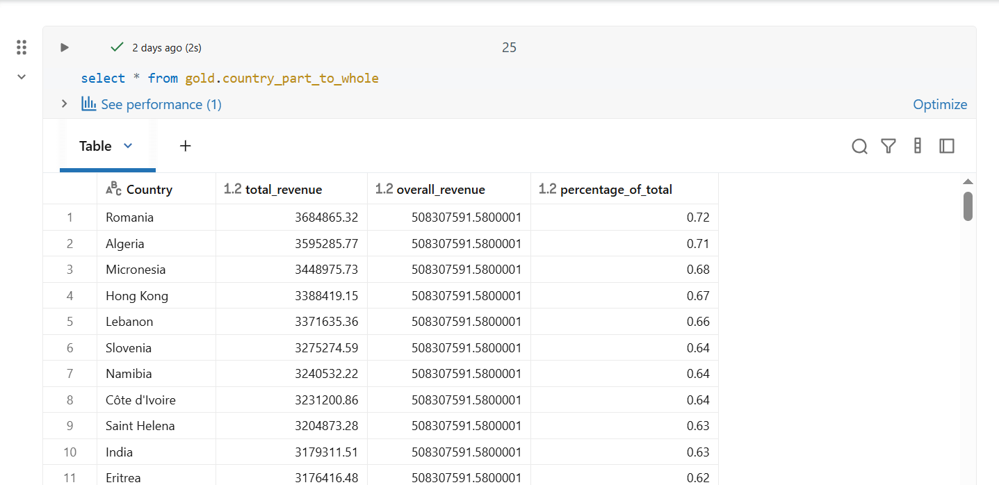

In this section we analyse the product performance to understand revenue growth and dips by examining revenue across dimensions of country, brands and time.

<h3> Product Metrics</h3>
<h4>Purpose: </h4>
    - Identify key performance Indicators

```
create or replace view gold.product_metrics as
with base_query as (
  /*
   Retrive core columns from the gold products and orders_fact tables
  */
  select
    of.OrderID,
    of.LastEditedWhen,
    of.CustomerID,
    round((of.Quantity * of.UnitPrice),2) as revenue,
    of.Quantity,
    of.UnitPrice,
    p.ProductID,
    p.ProductName,
    p.Brand
  from
    gold.orders_fact of
    left join gold.products p
    on of.ProductID = p.ProductID
  where
    p.active_flg = 1
)
,
product_aggregation as (
  /*
   Summarize key metrics
  */
  select
      ProductID,
      ProductName,
      Brand,
      UnitPrice,
      count(distinct OrderID) as total_orders,
      round(sum(revenue),2) as total_revenue,
      sum(Quantity) as total_quantity,
      count(distinct CustomerID) as total_customers,
      max(LastEditedWhen) as last_order_date,
      min(LastEditedWhen) as first_order_date,
      date_diff(MONTH, min(LastEditedWhen), max(LastEditedWhen)) as life_span,
      round(avg(UnitPrice), 2) average_price
  from
    base_query
  group by
    ProductID,
    ProductName,
    Brand,
    UnitPrice
)

/_
Combine all results into final output
_/
select
ProductID,
ProductName,
Brand,
UnitPrice,
last_order_date,
datediff(month, last_order_date, getdate()) as recency,
case when total_revenue > 50000 then 'High-Performer'
when total_revenue > 20000 and total_revenue <= 50000 then 'Mid-Range'
else 'Low-Performer'
end as product_segment,
life_span,
total_orders,
total_revenue,
total_quantity,
total_customers,
average_price,
--Average order Revenue (AVO)
case when total_orders = 0 then 0
else total_revenue / total_orders
end as Average_order_revenue,
--Average Monthly Revenue
case when life_span = 0 then total_revenue
else total_revenue / life_span
end as Average_monthly_revenue
from
product_aggregation

```



<h3> Performance Analysis (Year-over-Year) </h3>
<h4> Purpose: </h4>
    - To measure the performance of brands over time.
    - For benchmarking and identifying high-performing entities.
    - To track yearly trends and growth.

```

Create or replace view gold.YOY*Brands_Revenue AS
/* Analyze the yearly performance of brands by comparing their revenue
to both the average revenue performance of the brands and the previous year's revenue \_/
WITH yearly_brands_revenue AS (
SELECT
YEAR(of.LastEditedWhen) AS order_year,
p.Brand,
round(SUM(of.Quantity \* of.UnitPrice),2) AS current_revenue
FROM gold.orders_fact of
LEFT JOIN gold.products p
ON of.ProductID = p.ProductID
WHERE of.LastEditedWhen IS NOT NULL
GROUP BY
YEAR(of.LastEditedWhen),
p.Brand
)
SELECT
order_year,
Brand,
current_revenue,
round(AVG(current_revenue) OVER (PARTITION BY Brand),2) AS avg_revenue,
current_revenue - round(AVG(current_revenue) OVER (PARTITION BY Brand),2) AS diff_avg,
CASE
WHEN current_revenue - round(AVG(current_revenue) OVER (PARTITION BY Brand),2) > 0 THEN 'Above Avg'
WHEN current_revenue - round(AVG(current_revenue) OVER (PARTITION BY Brand),2) < 0 THEN 'Below Avg'
ELSE 'Avg'
END AS avg_change,
-- Year-over-Year Analysis
LAG(current_revenue) OVER (PARTITION BY Brand ORDER BY order_year) AS py_revenue,
current_revenue - LAG(current_revenue) OVER (PARTITION BY Brand ORDER BY order_year) AS diff_py,
CASE
WHEN current_revenue - LAG(current_revenue) OVER (PARTITION BY Brand ORDER BY order_year) > 0 THEN 'Increase'
WHEN current_revenue - LAG(current_revenue) OVER (PARTITION BY Brand ORDER BY order_year) < 0 THEN 'Decrease'
ELSE 'No Change'
END AS py_change
FROM yearly_brands_revenue
where order_year < 2025
ORDER BY Brand, order_year;

```



<h3> Ranking Analysis <h3>
<h4> Purpose: <h4>
    - To rank items (e.g., brands, products) based on performance or other metrics.
    - To identify top performers or laggards.
### Top 5 Brands by revenue

```

create or replace view gold.top*5_brands AS
SELECT *
/_
Ranking analysis using a flexible window function approach
Alternative, use TO and GROUP BY
_/
FROM (
SELECT
p.Brand,
round(SUM(of.Quantity \_ of.UnitPrice),2) AS total_revenue,
RANK() OVER (ORDER BY SUM(of.Quantity \* of.UnitPrice) DESC) AS rank_brands
FROM gold.orders_fact of
LEFT JOIN gold.products p
ON p.ProductID = of.ProductID
GROUP BY p.Brand
) AS ranked_brands
WHERE rank_brands <= 5;

```



<h3> Change Over Time Analysis </h3>
<h4> Purpose: <h4>
    - To track trends, growth, and changes in key metrics over time.
    - For time-series analysis and identifying seasonality.
    - To measure growth or decline over specific periods.

```

create or replace view gold.revenue_by_month AS
-- Analyse revenue performance over time
-- Quick DATE_TRUNC() Functions

SELECT
DATE_TRUNC('month', LastEditedWhen) AS order_date,
SUM(of.Quantity \* of.UnitPrice) AS total_revenue,
COUNT(DISTINCT CustomerID) AS total_customers,
SUM(quantity) AS total_quantity
FROM gold.orders_fact of
WHERE LastEditedWhen IS NOT NULL
GROUP BY DATE_TRUNC('month', LastEditedWhen)
ORDER BY DATE_TRUNC('month', LastEditedWhen);

```



<h3> Cumulative Analysis </h3>
<h4> Purpose: <h4>
    - To calculate running totals or moving averages for key metrics.
    - To track performance over time cumulatively.
    - Useful for growth analysis or identifying long-term trends.

SQL Functions Used: - Window Functions: SUM() OVER(), AVG() OVER()

```

create or replace view gold.cum_rev AS
-- Calculate the total revenue per year
-- and the running total of revenue over time

SELECT
order_date,
total_revenue,
SUM(total_revenue) OVER (ORDER BY order_date) AS running_total_revenue,
AVG(avg_price) OVER (ORDER BY order_date) AS moving_average_price
FROM
(
SELECT
DATE_TRUNC('year', of.LastEditedWhen) AS order_date,
round(SUM(of.Quantity \* of.UnitPrice),2) AS total_revenue,
round(AVG(of.UnitPrice),2) AS avg_price
FROM gold.orders_fact of
WHERE of.LastEditedWhen IS NOT NULL
GROUP BY DATE_TRUNC('year', of.LastEditedWhen)
) t

```



<h3>Cumulative Revenue by Brand</h3>

```

create or replace view gold.cum_rev_by_brand AS
-- Calculate the total revenue per year by brand
-- and the running total of revenue over time by brand

SELECT
Brand,
order_date,
total_revenue,
SUM(total_revenue) OVER (ORDER BY order_date) AS running_total_revenue,
AVG(avg_price) OVER (ORDER BY order_date) AS moving_average_price
FROM
(
SELECT
p.Brand,
DATE_TRUNC('year', of.LastEditedWhen) AS order_date,
round(SUM(of.Quantity \* of.UnitPrice),2) AS total_revenue,
round(AVG(of.UnitPrice),2) AS avg_price
FROM gold.orders_fact of
join gold.products p
ON of.ProductID = p.ProductID
WHERE of.LastEditedWhen IS NOT NULL and p.active_flg = 1
GROUP BY P.Brand, DATE_TRUNC('year', of.LastEditedWhen)
) t
where order_date < to_date('2025-01-01')
order by brand, order_date

```



<h3>Cumulative Revenue by Country and Brand</h3>

```

create or replace view gold.cum_rev_by_Country_brand AS
-- Calculate the total revenue per year by brand
-- and the running total of revenue over time by brand

SELECT
Country,
Brand,
order_date,
total_revenue,
SUM(total_revenue) OVER (ORDER BY order_date) AS running_total_revenue,
AVG(avg_price) OVER (ORDER BY order_date) AS moving_average_price
FROM
(
SELECT
c.Country,
p.Brand,
DATE_TRUNC('year', of.LastEditedWhen) AS order_date,
round(SUM(of.Quantity \* of.UnitPrice),2) AS total_revenue,
round(AVG(of.UnitPrice),2) AS avg_price
FROM gold.orders_fact of
left join gold.products p
ON of.ProductID = p.ProductID
left join gold.customers c
ON of.CustomerID = c.CustomerID
WHERE of.LastEditedWhen IS NOT NULL and p.active_flg = 1
GROUP BY c.Country, P.Brand, DATE_TRUNC('year', of.LastEditedWhen)
) t
where order_date < to_date('2025-01-01')
order by brand, order_date

```



<h3>Cumulative Revenue by Country</h3>

```

create or replace view gold.cum_rev_by_country AS
-- Calculate the total sales per month by Country/Region
-- and the running total of revenue over time by Country/Region

SELECT
country,
order_date,
total_revenue,
SUM(total_revenue) OVER (ORDER BY order_date) AS running_total_revenue,
AVG(avg_price) OVER (ORDER BY order_date) AS moving_average_price
FROM
(
SELECT
c.Country,
DATE_TRUNC('year', of.LastEditedWhen) AS order_date,
round(SUM(of.Quantity \* of.UnitPrice),2) AS total_revenue,
round(AVG(of.UnitPrice),2) AS avg_price
FROM gold.orders_fact of
join gold.customers c
ON of.CustomerID = c.CustomerID
WHERE of.LastEditedWhen IS NOT NULL and c.active_flg = 1
GROUP BY c.Country, DATE_TRUNC('year', of.LastEditedWhen)
) t
where order_date < to_date('2025-01-01')
order by Country, order_date

```



<h3> Part-to-Whole Analysis </h3>
<h4> Purpose:</h4>
    - To compare performance or metrics across dimensions or time periods.
    - To evaluate differences between categories.
    - Useful for A/B testing or regional comparisons.

```

create or replace view gold.brands_part_to_whole as
-- Which brands contribute the most to overall revenue?
WITH brand_revenue AS (
SELECT
p.Brand,
round(SUM(of.Quantity \* of.UnitPrice),2) AS total_revenue
FROM gold.orders_fact of
LEFT JOIN gold.products p
ON p.ProductID = of.ProductID
GROUP BY p.Brand
)

SELECT
Brand,
total_revenue,
SUM(total_revenue) OVER () AS overall_revenue,
ROUND((CAST(total_revenue AS FLOAT) / SUM(total_revenue) OVER ()) \* 100, 2) AS percentage_of_total
FROM brand_revenue
ORDER BY total_revenue DESC;

```



<h3> Country Part to Whole </h3>

```

create or replace view gold.country_part_to_whole as
-- Which Country/Region contribute the most to overall revenue?
WITH country_revenue AS (
SELECT
c.Country,
round(SUM(of.Quantity \* of.UnitPrice),2) AS total_revenue
FROM gold.orders_fact of
LEFT JOIN gold.customers c
ON c.CustomerID = of.CustomerID
GROUP BY c.Country
)

SELECT
Country,
total_revenue,
SUM(total_revenue) OVER () AS overall_revenue,
ROUND((CAST(total_revenue AS FLOAT) / SUM(total_revenue) OVER ()) \* 100, 2) AS percentage_of_total
FROM country_revenue
ORDER BY total_revenue DESC;

```


