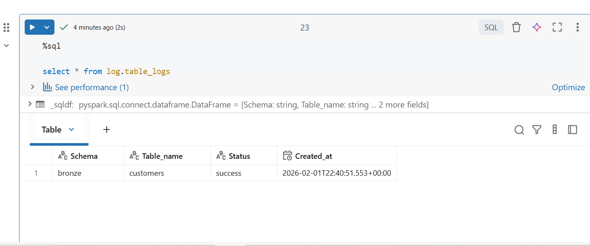
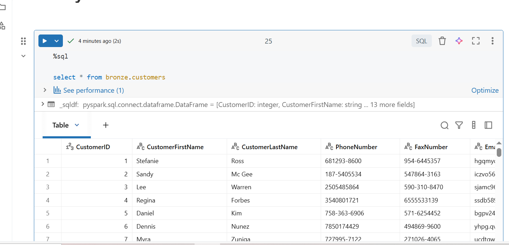

<h2>In this bronze layer we start by setup up global variables in the notebooks which will be referenced throughout the notebooks.</h2>

<b>We use PySpark for implementing this stage and the Great Expectations Python Library for schemas validations.</b>

The implementation steps are as follows:

Variables setup

```
#Variables for filepath and tablename
file_path_to_be_validated = '/Volumes/workspace/bronze/raw_files/customers/landing/customers.csv'
output_table_name = 'customers'
output_table_schema = 'bronze'
log_table_name = 'table_logs'
log_bad_table_name = 'bad_records'
log_table_schema = 'log'

archive_path  = '/Volumes/workspace/bronze/raw_files/customers/archive/'
```

Install Great Expectations (Ideally this should be installed in a shared environment used by all notebooks)

```
%pip install --q great_expectations
```

Implement functions for schema validation, saving to tables, archiving files, creating logs, handling validation success and failures. (ideally these should be in a module or package to share across notebooks)

```
import great_expectations as gx
from pyspark.sql import DataFrame
from datetime import datetime
from pyspark.sql.functions import lit, current_timestamp, col

def validate_schema_with_gx(
    df: DataFrame,
    schema: dict,
    expected_row_count: int = None,
    check_ordered_columns: bool = True,
    enable_length_check: bool = False
) -> bool:
    ''' Function to validates input dataframe against a schema using Great Expectations.
    Input: df (dataframe), schema (dict), expected_row_count (int), check_ordered_columns (bool), enable_length_check (bool)
    Output: bool
    '''

    """
    Runs Great Expectations checks on a Spark DataFrame.
    """

    """
    # 1) Build a transient GX context and Spark datasource
    context = gx.get_context()
    ds = context.data_sources.add_spark(name="spark_in_memory")
    asset = ds.add_dataframe_asset(name="df_asset")
    batch_def = asset.add_batch_definition_whole_dataframe("df_batch")
    batch = batch_def.get_batch(batch_parameters={"dataframe": df})
    """
    # 1) Build a transient GX context and Pandas Dataframe datasource
    context = gx.get_context()
    datasource = context.data_sources.add_pandas(name="pandas_datasource")
    name = "df_dataframe"
    data_asset = datasource.add_dataframe_asset(name=name)
    batch_definition_name = "df_batch"
    batch_definition = data_asset.add_batch_definition_whole_dataframe(
    batch_definition_name
    )
    batch_parameters = {"dataframe": df}

    # Get the dataframe as a Batch
    batch = batch_definition.get_batch(batch_parameters=batch_parameters)

    # 2) Run expectations per schema
    from great_expectations import expectations as E
    results = []
    ordered_cols = []
    for col, props in schema.items():
        ordered_cols.append(col)

        if props.get("unique", False):
            results.append(batch.validate(E.ExpectColumnValuesToBeUnique(column=col)))
        if props.get("nullable", True) is False:
            results.append(batch.validate(E.ExpectColumnValuesToNotBeNull(column=col)))

        dtype = props.get("dtype")
        if dtype:
            results.append(batch.validate(E.ExpectColumnValuesToBeOfType(column=col, type_=dtype)))

        if enable_length_check:
            size = props.get("size")
            if size is not None:
                results.append(
                    batch.validate(
                        E.ExpectColumnValueLengthsToBeBetween(
                            column=col, min_value=None, max_value=int(size), strict_max=True
                        )
                    )
                )

    # 3) Table-level expectations
    if check_ordered_columns:
        results.append(batch.validate(E.ExpectTableColumnsToMatchOrderedList(column_list=ordered_cols)))
    if expected_row_count is not None:
        results.append(batch.validate(E.ExpectTableRowCountToEqual(value=int(expected_row_count))))

    # 4) Summarize results
    total = len(results)
    successes = sum(1 for r in results if getattr(r, "success", False))
    failures = total - successes

    print(f"[DQ] Expectations run: {total} | Passed: {successes} | Failed: {failures}")
    if failures > 0:
        for r in results:
            if not getattr(r, "success", False):
                cfg = getattr(r, "expectation_config", None)
                etype = getattr(cfg, "type", "unknown") if cfg else "unknown"
                kwargs = getattr(cfg, "kwargs", {}) if cfg else {}
                print(f"[DQ][FAIL] {etype} {kwargs}")
        print("[DQ] Data Quality validation failed.")
        return False
        #raise Exception("Data Quality validation failed.")
    else:
        print("[DQ] All checks passed ✔️")
        return True


def write_data_to_lakehouse_table(df_name, table_name, schema, log_schema, log_table) -> None:
    ''' Input: df_name  (dataframe), table_name (str), log_schema (str), log_table (str), log_table (str)
    Function: Reads data from CSV file path, adds a record_creation_date field and writes to Lakehouse table.
    Output: None
    '''

    time_now = datetime.now()
    df_name = df_name.withColumn('record_creation_date', lit(time_now))
    df_name.write.format("delta").mode("append").saveAsTable(f"{schema}.{table_name}")

    #log table creation
    log_table_creation(schema, table_name, log_schema, log_table, 'success', time_now)

def log_table_creation(schema, table_name, log_schema, log_table, load_status, time_now) -> None:
    '''
    This function logs the table creation event to a log table
    Input: schema (str), table_name (str), time_now (datetime)
    '''
    log_df = spark.createDataFrame(
        [(schema, table_name, load_status, time_now)],
        ["Schema", "Table_name", "Status", "Created_at"]
    )
    log_df.write.format("delta").mode("append").saveAsTable(f"{log_schema}.{log_table}")

def move_file_to_archive_folder(src, dst) -> None:
    ''' Input: src (str), dst (str)
    Function: Moves file from src to dst
    Output: None
    '''
    dbutils.fs.mv(src, dst)

def handle_sucess(df_name, output_table_name, output_table_schema, source_path, archive_path, log_schema, log_table) -> None:
    ''' Function to handle a successful validation run
    Input: df_name (dataframe), output_table_name (str), output_table_schema (str), log_schema (str), log_table (str), archive_path (str)
    This could include:
    1) write file contents to raw lakehouse table
    2) write log to log table
    3) move file to archive folder
    '''

    # Write file content to lakehouse table and log table
    write_data_to_lakehouse_table(df_name, output_table_name, output_table_schema, log_schema, log_table)

    #move file to archive folder
    move_file_to_archive_folder(source_path, archive_path)


def handle_failure(schema, table_name, log_schema, log_table_name) -> None:
    '''
    Input: schema (str), table_name (str)
    Function to handle a failed validation run
    This could include:
    1) failure logging
    '''
    time_now = datetime.now()

    #log table creation
    log_table_creation(schema, table_name, log_schema, log_table_name, 'failure', time_now)

def log_corrupted_records(df_name, schema, table_name, log_schema, log_table, time_now) -> None:
    '''
    This function logs the table corrupted records to a log table
    Input: df_name (dataframe), log_schema (str), log_table (str), time_now (datetime)
    log_df = spark.createDataFrame (str), table_name (str), time_now (datetime)
    '''
    log_df = df_name.withColumn('Schema', lit(schema)) \
                    .withColumn('Table_name', lit(table_name)) \
                    .withColumn('record_creation_date', lit(time_now))
    log_df.write.format("delta").mode("append").saveAsTable(f"{log_schema}.{log_table}")

```

Define schema for validation

```
# Expect the columns to be from the expected column set
spark_expected_schema = {
    "CustomerID":         {"size": None, "dtype": "IntegerType",  "unique": True,  "nullable": False},
    "CustomerFirstName":       {"size": 255,  "dtype": "StringType",   "unique": False, "nullable": False},
    "CustomerLastName":       {"size": 255,  "dtype": "StringType",   "unique": False, "nullable": False},
    "PhoneNumber":       {"size": 15,  "dtype": "StringType",   "unique": False, "nullable": False},
    "FaxNumber":       {"size": 15,  "dtype": "StringType",   "unique": False, "nullable": False},
    "Email":       {"size": 100,  "dtype": "StringType",   "unique": False, "nullable": False},
    "Address":       {"size": 150,  "dtype": "StringType",   "unique": False, "nullable": False},
    "City":       {"size": 100,  "dtype": "StringType",   "unique": False, "nullable": False},
    "State":       {"size": 100,  "dtype": "StringType",   "unique": False, "nullable": False},
    "Zip":       {"size": 25,  "dtype": "StringType",   "unique": False, "nullable": False},
    "Country":       {"size": 150,  "dtype": "StringType",   "unique": False, "nullable": False},
    "ValidFrom": {"size": None, "dtype": "TimestampType","unique": False, "nullable": True},
    "ValidTo": {"size": None, "dtype": "TimestampType","unique": False, "nullable": True},
}


panda_expected_schema = {
    "CustomerID":         {"size": None, "dtype": "int32",  "unique": True,  "nullable": False},
    "CustomerFirstName":       {"size": 255,  "dtype": "object",   "unique": False, "nullable": False},
    "CustomerLastName":       {"size": 255,  "dtype": "object",   "unique": False, "nullable": False},
    "PhoneNumber":       {"size": 15,  "dtype": "object",   "unique": False, "nullable": False},
    "FaxNumber":       {"size": 15,  "dtype": "object",   "unique": False, "nullable": False},
    "Email":       {"size": 100,  "dtype": "object",   "unique": False, "nullable": False},
    "Address":       {"size": 150,  "dtype": "object",   "unique": False, "nullable": False},
    "City":       {"size": 100,  "dtype": "object",   "unique": False, "nullable": False},
    "State":       {"size": 100,  "dtype": "object",   "unique": False, "nullable": False},
    "Zip":       {"size": 25,  "dtype": "object",   "unique": False, "nullable": False},
    "Country":       {"size": 150,  "dtype": "object",   "unique": False, "nullable": False},
    "ValidFrom": {"size": None, "dtype": "datetime64","unique": False, "nullable": True},
    "ValidTo": {"size": None, "dtype": "datetime64","unique": False, "nullable": True},
}

```

Create Schema for incoming data

```

from pyspark.sql.functions import col, to_timestamp
from pyspark.sql.types import StructType, StructField, IntegerType, StringType, DateType, TimestampType

#Create a schema for customers' data
customers_schema = StructType(
    [
    StructField('CustomerID', IntegerType(), False),
    StructField('CustomerFirstName', StringType(), False),
    StructField('CustomerLastName', StringType(), False),
    StructField('PhoneNumber', StringType(), False),
    StructField('FaxNumber', StringType(), False),
    StructField('Email', StringType(), False),
    StructField('Address', StringType(), False),
    StructField('City', StringType(), False),
    StructField('State', StringType(), False),
    StructField('Zip', StringType(), False),
    StructField('Country', StringType(), False),
    StructField('ValidFrom', StringType(), True),
    StructField('ValidTo', StringType(), True),
    StructField('corrupt_record', StringType(), True)])

```

Use PySpark to put incoming data into dataframe, format date columns, and put corrupted records into separate dataframe.

NB. Convert Spark dataframe to Pandas dataframe to carry out validation (only needed because we are using a serverless compute from Databricks)

```
#Create a dataframe to hold customers' data

#Handle corrupted data
customers_df = spark.read.format("csv").option("header", "true").option("ColumnNameOfCorruptRecord", "corrupt_record").option("mode", "PERMISSIVE").schema(customers_schema).load(file_path_to_be_validated)

#convert datetime columns from string to datetime
customers_df = customers_df.withColumn("ValidFrom", to_timestamp(col("ValidFrom"), "yyyy.MM.dd hh:mm:ss")).withColumn("ValidTo", to_timestamp(col("ValidTo"), "yyyy.MM.dd hh:mm:ss"))

corrupted_records_df = customers_df.filter(customers_df["corrupt_record"].isNotNull())
p_customers_df = customers_df.withColumn('ValidTo', lit('2030-01-01 00:00:00')).withColumn("ValidTo", to_timestamp(col("ValidTo"), "yyyy-MM-dd HH:mm:ss")).drop("corrupt_record")
#Get count to customers
expected_rows = customers_df.count()

#
p_df = p_customers_df.toPandas()
```

Perform schema validation on dataframe

```
#Get count to customers
expected_rows = customers_df.count()

# TO USE WITH A COMPUTE CONFIGURATION
validated = validate_schema_with_gx(
    df=p_df,
    schema=panda_expected_schema,
    expected_row_count=expected_rows,
    check_ordered_columns=True,
    enable_length_check=False
)
```

Validation results


Add insert date

```
#add insert column
customers_df = customers_df.withColumn("insert_dt", current_timestamp())

customers_df.printSchema()
```

If schema is validated, save data to table, move source file to archive and create a success log in log table, otherwise create a failure log in log table

```

# Read data from landing based on max timestamp
if validated:
    if corrupted_records_df.count() > 0:
        log_corrupted_records(corrupted_records_df, output_table_name, output_table_schema, log_table_schema, log_bad_table_name)

    df = spark.read.table(f"{log_table_schema}.{log_table_name}")
    row1 = df.where(f"Table_name = '{output_table_name}' and schema = '{output_table_schema}'").groupBy("Table_name").agg({"Created_at": "max"}).first()
    if row1 is None:
        max_timestamp = datetime(1900, 1, 1)
    else:
        max_timestamp = row1[1]

    row2 = customers_df.agg({"insert_dt": "max"}).first()
    max_timestamp2 = row2[0]
    if max_timestamp2 > max_timestamp:
        #remove corrupted records
        customers_df = customers_df.where(col("corrupt_record").isNull()).drop(col("corrupt_record"))
        handle_sucess(customers_df, output_table_name, output_table_schema, file_path_to_be_validated, archive_path, log_table_schema, log_table_name)


else:
    handle_failure(output_table_name, output_table_schema, log_table_schema, log_table_name)
```

Log output


Data output


This process is repeated for the suppliers, products and orders data
