<h2>In this gold layer we start by setup up global variables in the notebooks which will be referenced throughout the notebooks.</h2>

<b>We use PySpark for implementing this stage and the Great Expectations Python Library for data validations.</b>

The implementation steps are as follows:

Variables setup

```
#Job Parameters
output_schema_name = "gold"
output_table_name = "customers"
table_full_name = f"{output_schema_name}.{output_table_name}"
stage_table_full_name = "silver.customers"
log_schema_name = "log"
log_table_name = 'table_logs'
```

Read data into dataframe from the silver layer

```
# Read data from Staging/Silver
df_stg = spark.read.table(stage_table_full_name)

print("SPARK_APP: Staging Data Count - " + str(df_stg.count()))
print("SPARK_APP: Printing Staging Schema --")
df_stg.printSchema()
```

Import key libraries

```

from pyspark.sql.functions import current_timestamp, col, expr, to_date, date_format, udf, lit, sha2, concat_ws
from pyspark.sql.types import StringType
from datetime import datetime
from delta import DeltaTable
import uuid
import pandas as pd

```

Create logic for surrogate keys and lists of columns for hash keys

```

# Generated uuid UDF for Surrogate Key
uuidUDF = udf(lambda : str(uuid.uuid4()),StringType())

#Hash columns for Type 1 and Type 2 SCD
hash1Col = ['PhoneNumber','FaxNumber','Email'] # List of Type 1 columns
hash2Col = ['CustomerFirstName','CustomerLastName','Address','City','State','Zip','Country']

```

Apply surrogate keys and hash columns to dataframe

```

# Generate SURROGATE KEYs and Hashes and add them to dataframe
df_dim_temp = df_stg.withColumn("skey", uuidUDF()).withColumn("Hash1", lit(sha2(concat_ws("~", *hash1Col), 256))) \
   .withColumn("Hash2", lit(sha2(concat_ws("~", *hash2Col), 256)))

print("SPARK_APP: Dim Temp Data Count - " + str(df_dim_temp.count()))
print("SPARK_APP: Printing Dim Temp Schema --")
df_dim_temp.printSchema()

```

%pip install --q great_expectations

```

Implement functions for data validation, saving to tables, archiving files, creating logs, handling validation success and failures. (ideally these should be in a module or package to share across notebooks)

```

import great_expectations as gx
from great_expectations.core.batch import RuntimeBatchRequest
from pyspark.sql import DataFrame
from pyspark.sql.functions import lit, current_timestamp, col

def validate_gold_with_gx(
df: DataFrame,
schema: dict,
expected_row_count: int = None,
enable_length_check: bool = True

) -> bool:
'''
Input: df (dataframe), schema (dict), expected_row_count (int), enable_length_check (bool)

        Output: True if all expectations pass, False otherwise
    '''
    """
    Runs Great Expectations checks on a Spark DataFrame.
    """
    """
    # 1) Build a transient GX context and Spark datasource
    context = gx.get_context()
    ds = context.data_sources.add_spark(name="spark_in_memory")
    asset = ds.add_dataframe_asset(name="df_asset")
    batch_def = asset.add_batch_definition_whole_dataframe("df_batch")
    batch = batch_def.get_batch(batch_parameters={"dataframe": df})
    """
    # 1) Build a transient GX context and Pandas datasource
    context = gx.get_context()
    datasource = context.data_sources.add_pandas(name="pandas_datasource")
    name = "df_dataframe"
    data_asset = datasource.add_dataframe_asset(name=name)
    batch_definition_name = "df_batch"
    batch_definition = data_asset.add_batch_definition_whole_dataframe(
    batch_definition_name
    )
    batch_parameters = {"dataframe": df}

    # Get the dataframe as a Batch
    batch = batch_definition.get_batch(batch_parameters=batch_parameters)


    from great_expectations import expectations as E
    results = []
    ordered_cols = []

    # 2) Table-level expectations
    for col, props in schema.items():
        ordered_cols.append(col)

        if props.get("unique", False):
            results.append(batch.validate(E.ExpectColumnValuesToBeUnique(column=col)))
        if props.get("nullable", True) is False:
            results.append(batch.validate(E.ExpectColumnValuesToNotBeNull(column=col)))

        dtype = props.get("dtype")
        if dtype:
            results.append(batch.validate(E.ExpectColumnValuesToBeOfType(column=col, type_=dtype)))

        if enable_length_check:
            size = props.get("size")
            if size is not None:
                results.append(
                    batch.validate(
                        E.ExpectColumnValueLengthsToBeBetween(
                            column=col, min_value=None, max_value=int(size), strict_max=True
                        )
                    )
                )


    if expected_row_count is not None:
        results.append(batch.validate(E.ExpectTableRowCountToEqual(value=int(expected_row_count))))
    # 4) Summarize results
    total = len(results)
    successes = sum(1 for r in results if getattr(r, "success", False))
    failures = total - successes
    print(f"[DQ] Expectations run: {total} | Passed: {successes} | Failed: {failures}")
    if failures > 0:
        for r in results:
            if not getattr(r, "success", False):
                cfg = getattr(r, "expectation_config", None)
                etype = getattr(cfg, "type", "unknown") if cfg else "unknown"
                kwargs = getattr(cfg, "kwargs", {}) if cfg else {}
                print(f"[DQ][FAIL] {etype} {kwargs}")
        return False
        #raise Exception("Data Quality validation failed.")
    else:
        print("[DQ] All checks passed ✔️")
        return True

def write_data_to_lakehouse_table(df_name, table_name, schema, log_schema, log_table) -> None:
''' Input: df_name (dataframe), table_name (str), log_schema (str), log_table (str), log_table (str)
Function: Reads data from CSV file path, adds a record_creation_date field and writes to Lakehouse table.
Output: None
'''

    time_now = datetime.now()
    df_name = df_name.withColumn('record_creation_date', lit(time_now))
    df_name.write.format("delta").mode("append").saveAsTable(f"{schema}.{table_name}")

    #log table creation
    log_table_creation(schema, table_name, log_schema, log_table, 'success', time_now)

def log_table_creation(schema, table_name, log_schema, log_table, load_status, time_now) -> None:
'''
This function logs the table creation event to a log table
Input: schema (str), table_name (str), time_now (datetime)
'''
log_df = spark.createDataFrame(
[(schema, table_name, load_status, time_now)],
["Schema", "Table_name", "Status", "Created_at"]
)
log_df.write.format("delta").mode("append").saveAsTable(f"{log_schema}.{log_table}")

def handle_sucess(df_name, output_table_name, output_table_schema, log_schema, log_table) -> None:
''' Function to handle a successful validation run
Input: df_name (dataframe), output_table_name (str), output_table_schema (str), log_schema (str), log_table (str), archive_path (str)
This could include: 1) write file contents to raw lakehouse table 2) write log to log table
'''

    # Write file content to lakehouse table and log table
    write_data_to_lakehouse_table(df_name, output_table_name, output_table_schema, log_schema, log_table)

def handle_failure(schema, table_name, log_schema, log_table_name) -> None:
'''
Input: schema (str), table_name (str)
Function to handle a failed validation run
This could include: 1) failure logging
'''
time_now = datetime.now()

    #log table creation
    log_table_creation(schema, table_name, log_schema, log_table_name, 'failure', time_now)

```

Schema definition for validation.
NB. schema is validated again to ensure all columns are available for analysis.

```

# Expect the columns to be from the expected column set

spark_expected_schema = {
"CustomerID": {"size": None, "dtype": "StringType", "unique": True, "nullable": False},
"CustomerFirstName": {"size": 255, "dtype": "StringType", "unique": False, "nullable": False},
"CustomerLastName": {"size": 255, "dtype": "StringType", "unique": False, "nullable": False},
"PhoneNumber": {"size": 15, "dtype": "StringType", "unique": False, "nullable": False},
"FaxNumber": {"size": 15, "dtype": "StringType", "unique": False, "nullable": False},
"Email": {"size": 100, "dtype": "StringType", "unique": False, "nullable": False},
"Address": {"size": 150, "dtype": "StringType", "unique": False, "nullable": False},
"City": {"size": 100, "dtype": "StringType", "unique": False, "nullable": False},
"State": {"size": 100, "dtype": "StringType", "unique": False, "nullable": False},
"Zip": {"size": 25, "dtype": "StringType", "unique": False, "nullable": False},
"Country": {"size": 150, "dtype": "StringType", "unique": False, "nullable": False},
"effective_start_dt": {"size": None, "dtype": "TimestampType","unique": False, "nullable": False},
"effective_end_dt": {"size": None, "dtype": "TimestampType","unique": False, "nullable": True},
"active_flg": {"size": 1, "dtype": "IntegerType","unique": False, "nullable": False},
"insert_dt": {"size": None, "dtype": "TimestampType","unique": False, "nullable": True},
"update_dt": {"size": None, "dtype": "TimestampType","unique": False, "nullable": False},
"record_creation_date": {"size": None, "dtype": "TimestampType","unique": False, "nullable": True},
"skey": {"size": 255, "dtype": "StringType","unique": True, "nullable": False},
"Hash1": {"size": None, "dtype": "StringType","unique": False, "nullable": True},
"Hash2": {"size": None, "dtype": "StringType","unique": False, "nullable": True},
}

panda_expected_schema = {
"CustomerID": {"size": None, "dtype": "int32", "unique": True, "nullable": False},
"CustomerFirstName": {"size": 255, "dtype": "object", "unique": False, "nullable": False},
"CustomerLastName": {"size": 255, "dtype": "object", "unique": False, "nullable": False},
"PhoneNumber": {"size": 15, "dtype": "object", "unique": False, "nullable": False},
"FaxNumber": {"size": 15, "dtype": "object", "unique": False, "nullable": False},
"Email": {"size": 100, "dtype": "object", "unique": False, "nullable": False},
"Address": {"size": 150, "dtype": "object", "unique": False, "nullable": False},
"City": {"size": 100, "dtype": "object", "unique": False, "nullable": False},
"State": {"size": 100, "dtype": "object", "unique": False, "nullable": False},
"Zip": {"size": 25, "dtype": "object", "unique": False, "nullable": False},
"Country": {"size": 150, "dtype": "object", "unique": False, "nullable": False},
"effective_start_dt": {"size": None, "dtype": "datetime64","unique": False, "nullable": False},
"effective_end_dt": {"size": None, "dtype": "datetime64","unique": False, "nullable": True},
"active_flg": {"size": 1, "dtype": "int32","unique": False, "nullable": False},
"insert_dt": {"size": None, "dtype": "datetime64","unique": False, "nullable": True},
"update_dt": {"size": None, "dtype": "datetime64","unique": False, "nullable": False},
"record_creation_date": {"size": None, "dtype": "datetime64","unique": False, "nullable": True},
"skey": {"size": 255, "dtype": "object","unique": True, "nullable": False},
"Hash1": {"size": None, "dtype": "object","unique": False, "nullable": True},
"Hash2": {"size": None, "dtype": "object","unique": False, "nullable": True},
}

```

Apply schema validation

NB. Convert Spark dataframe to Pandas dataframe to carry out validation (only needed because we are using a serverless compute from Databricks)

```

df_dim_temp1 = df_dim_temp

#Get count to customers
expected_rows = df_dim_temp.count()

p_df = df_dim_temp1.toPandas()

validated = validate_gold_with_gx(
df=p_df,
schema=panda_expected_schema,
expected_row_count=expected_rows,
enable_length_check=False
)

```

Validation results
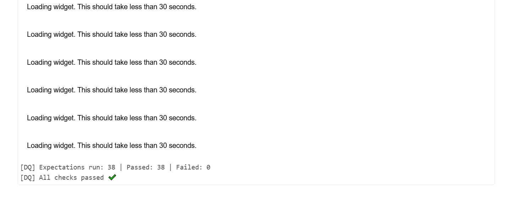


Re-organize columns for Slowly Changing Dimension processing

```

df_dim_temp = df_dim_temp.selectExpr(
"skey",
"CustomerID",
"CustomerFirstName",
"CustomerLastName",
"PhoneNumber",
"FaxNumber",
"Email",
"Address",
"City",
"State",
"Zip",
"Country",
"active_flg",
"insert_dt",
"update_dt",
"record_creation_date",
"effective_start_dt",
"effective_end_dt",
"Hash1",
"Hash2"
)
df_dim_temp.printSchema()

```

Prepare data for Slowly Changing Dimension processing by separating records to insert and records to update.

```

# Establish connection to delta table

target_dt = DeltaTable.forName(spark, table_full_name)

# Collecting the rows which need to be inserted into the delta table (SCD Type 2)

newRowsToInsert = df_dim_temp \
 .alias("updates") \
 .join(target_dt.toDF().alias("target"), ['CustomerID'], how = 'inner') \
 .where("target.active_flg = 1 AND updates.Hash2 <> target.Hash2") \
 .selectExpr("updates.\*")

# Creating a data frame of all rows before the merge

staged_updates = (
newRowsToInsert
.selectExpr("'Y' as isInsert", # Rows are flagged as inserts
"updates.skey",
"updates.CustomerID",
"updates.CustomerFirstName",
"updates.CustomerLastName",
"updates.PhoneNumber",
"updates.FaxNumber",
"updates.Email",
"updates.Address",
"updates.City",
"updates.State",
"updates.Zip",
"updates.Country",
"updates.active_flg",
"updates.insert_dt",
"updates.update_dt",
"updates.record_creation_date",
"updates.effective_start_dt",
"updates.effective_end_dt",
"updates.Hash1",
"updates.Hash2" )
.union(df_dim_temp.selectExpr("'N' as isInsert", \*df_dim_temp.columns))
)

display(staged_updates)

```

Implement Slowly Changing Dimension Type 1 and 2 logic on data on validated dataframe and log results

```

# Insert all records in Delta Table in APPEND mode

if validated:

    # Create the UPSERT logic
    target_dt.alias("target").merge(
    staged_updates.alias("updates"),
    "updates.CustomerID = target.CustomerID AND isInsert = 'N'") \
    .whenMatchedUpdate( # Type 1 update. Type 2 updates skip this even if they contain a Type 1
    condition = "target.active_flg = 1 AND target.Hash1 <> updates.Hash1 AND target.Hash2 = updates.Hash2",
    set = {'Email': 'updates.Email',
                    'PhoneNumber': 'updates.PhoneNumber',
                    'FaxNumber': 'updates.PhoneNumber',
                    'update_dt': current_timestamp()}
    ).whenMatchedUpdate( # Type 2 update
    condition = "target.active_flg = '1' AND (updates.Hash2 <> target.Hash2)",
    set = {
            "active_flg": '0',
        "effective_end_dt": current_timestamp()
    }
    ).whenNotMatchedInsert( # Type 2 Insert and new rows
    values = {
                "skey" : "updates.skey",
                "CustomerID" :"updates.CustomerID",
                "CustomerFirstName": "updates.CustomerFirstName",
                "CustomerLastName": "updates.CustomerLastName",
                "PhoneNumber": "updates.PhoneNumber",
                "FaxNumber": "updates.FaxNumber",
                "Email": "updates.Email",
                "Address": "updates.Address",
                "City": "updates.City",
                "State": "updates.State",
                "Zip": "updates.Zip",
                "Country": "updates.Country",
                "active_flg": "updates.active_flg",
                "insert_dt": "updates.insert_dt",
                "update_dt" : "updates.update_dt",
                "record_creation_date": "updates.record_creation_date",
                "effective_start_dt": "updates.effective_start_dt",
                "effective_end_dt": "updates.effective_end_dt",
                "Hash1": "updates.Hash1",
                "Hash2": "updates.Hash2"
             }
    ).execute()
    log_table_creation(output_schema_name, output_table_name, log_schema_name, log_table_name,"success",datetime.now())
    print("SPARK_APP: Updated History Records")

else:
handle_failure(output_table_name, output_schema_name, log_table_name, log_schema_name)

```

After we added the first load of customers, we processed another list of new records and updated some existing records in date customers gold table. The results is shown below old records with and active flag of 0 and new/updated records with an active flag of 1 (output columns split across image).

log
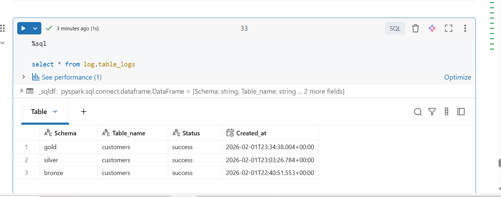

filtered records beyond the original 10000 records
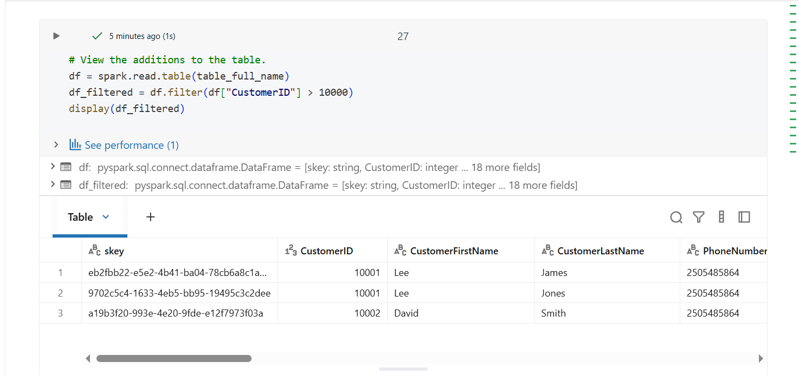
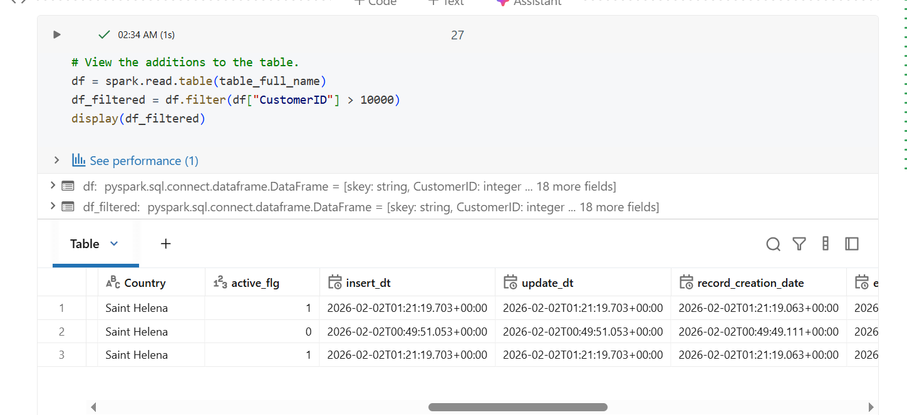

SCD data output
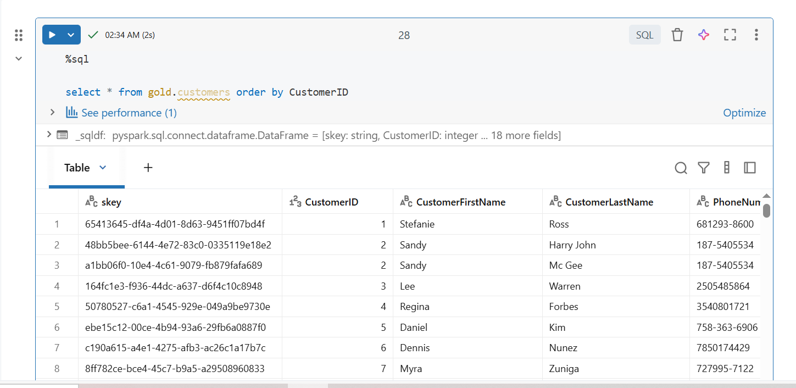
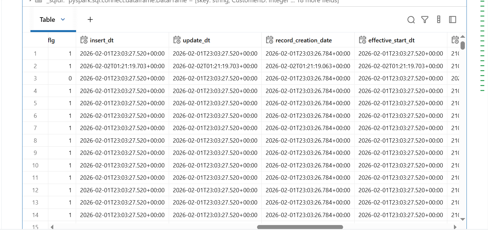
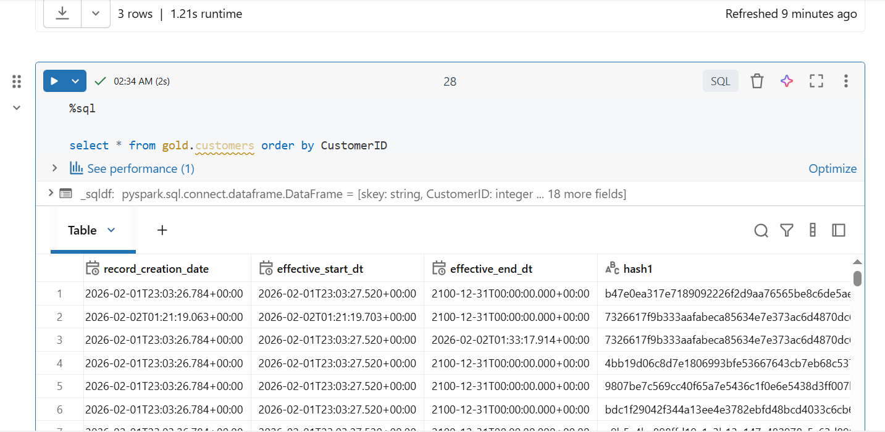


This process is repeated for the suppliers, products

---

## Date Dimension Table

## Create date dimension table in code.

Create table definition

```

# Create Date Dimension

spark.sql("""drop table if exists gold.dim_date""");

spark.sql("""
create table gold.dim_date (
DateKey string,
date date,
day int,
Weekday int,
WeekDayName string,
IsWeekend BOOLEAN,
DOWInMonth TINYINT,
DayOfYear TINYINT,
WeekOfMonth TINYINT,
WeekOfYear TINYINT,
month int,
MonthName string,
Quarter TINYINT,
QuarterName string,
year int,
MMYYYY string,
MonthYear string,
FirstDayOfMonth date,
LastDayOfMonth date,
FirstDayOfQuarter date,
LastDayOfQuarter date,
FirstDayOfYear date,
LastDayOfYear date,
rundate string,
insert_dt timestamp,
update_dt timestamp
)
USING DELTA
PARTITIONED BY (`year`,`month`,`day`)
""");

print("SPARK-APP: Date dimension created")

Variables to use in notebook

```
#Job Parameters
rundate = "19800101" #get_rundate()
output_schema_name = "gold"
output_table_name = "dim_date"
table_full_name = f"{output_schema_name}.{output_table_name}"
log_schema_name = "log"
log_table_name = 'table_logs'

```

Import libraries

```
from datetime import datetime, timedelta
from pyspark.sql import SparkSession, DataFrame, udf
from pyspark.sql.types import StringType
import json
from math import ceil
import calendar
```

Implement functions to create list of dates for specified period

```

def week_of_month(dt):
    """ Returns the week of the month for the specified date.
    """

    first_day = dt.replace(day=1)

    dom = dt.day
    adjusted_dom = dom + first_day.weekday()

    return int(ceil(adjusted_dom/7.0))

def date_data(start_run_dt: str = '20200101', num_years: int = 5) -> list:
	_data = []
	wd = ['Monday','Tuesday','Wednesday','Thursday','Friday','Saturday','Sunday']
	weekdays_dic ={'Monday':2, 'Tuesday':3,'Wednesday':4,'Thursday':5,'Friday':6,'Saturday':7, 'Sunday':1}
	qn = ['First', 'Second','Third','Fourth']
	_start_date = datetime.strptime(start_run_dt, '%Y%m%d')
	currQuarter = int((_start_date.month - 1) / 3 + 1)
	_data.append([
        datetime.strftime(_start_date, '%Y-%m-%d'),
        datetime.strftime(_start_date, '%d'),
		weekdays_dic[wd[_start_date.weekday()]],
		wd[_start_date.weekday()],
		0 if _start_date.weekday() < 5 else 1,
		week_of_month(_start_date),
		_start_date.timetuple().tm_yday,  # returns 1 for January 1st
		week_of_month(_start_date),
		_start_date.isocalendar()[1],
        datetime.strftime(_start_date, '%m'),
		_start_date.strftime("%B"),
		currQuarter,
		qn[int((_start_date.month - 1) / 3)],
		_start_date.year,
        datetime.strftime(_start_date, '%m%Y'),
        _start_date.strftime("%B") + str(_start_date.year),
		_start_date.replace(day=1),
		calendar.monthrange(_start_date.year, _start_date.month)[1],
		datetime(_start_date.year, 3 * currQuarter - 2, 1),
		datetime(_start_date.year, 3 * currQuarter , 1) + timedelta(days=-1),
		_start_date.date().replace(month=1, day=1),
		_start_date.date().replace(month=12, day=31)])
	_next_date = _start_date
	for i in range(0, num_years*364):
		_next_date = _next_date + timedelta(days = 1)
		currQuarter = int((_next_date.month - 1) / 3 + 1)
		_data.append([
			datetime.strftime(_next_date, '%Y-%m-%d'), #date
			datetime.strftime(_next_date, '%d'), #day
			weekdays_dic[wd[_next_date.weekday()]], #weekday
			wd[_next_date.weekday()], #weekdayName
			0 if _next_date.weekday() < 5 else 1,#weekend
			week_of_month(_next_date),#DOWinMonth
			_next_date.timetuple().tm_yday,  # DayOfYear
			week_of_month(_next_date),#Week of Month
			_next_date.isocalendar()[1],#Week of year
			datetime.strftime(_next_date, '%m'), #Month
			_next_date.strftime("%B"), #MonthName
			currQuarter, #Quarter
			qn[int((_next_date.month - 1) / 3)], #QuarterName
			_next_date.year, #Year
			datetime.strftime(_next_date, '%m%Y'),#mmYYYY
            _next_date.strftime("%B") + str(_next_date.year), #monthNameYear
			_next_date.replace(day=1),#first of month
			#calendar.monthrange(_next_date.year, _next_date.month)[1],#End of Month
      		datetime(_next_date.year, _next_date.month,calendar.monthrange(_next_date.year, _next_date.month)[1]  ),#End of Month
			datetime(_next_date.year, 3 * currQuarter - 2, 1), #First of Quarter
			datetime(_next_date.year, 3 * currQuarter , 1) + timedelta(days=-1),# end of wuarter
			_next_date.date().replace(month=1, day=1),#first of year
			_next_date.date().replace(month=12, day=31)])# end of year

	return _data

```

Create schema and list of dates to create dataframe

List contains dates for the 50 years starting from Jan 1, 1980

```

_cols = ['date','day','Weekday','WeekDayName','IsWeekend','DOWInMonth','DayOfYear','WeekOfMonth','WeekOfYear','month','MonthName','Quarter','QuarterName','year','MMYYYY','MonthYear','FirstDayOfMonth','LastDayOfMonth','FirstDayOfQuarter','LastDayOfQuarter','FirstDayOfYear','LastDayOfYear']
_data = date_data(rundate, 50)

```

Create dataframe from schema and list of dates

```
# Create Raw dataframe and get col info
df_raw = spark.createDataFrame(data=_data[1:], schema=_cols)
print("SPARK_APP: Printing Raw Schema --")
df_raw.printSchema()

```

Add date surrogate keys to dataframe

```

from pyspark.sql.functions import current_timestamp, expr, to_date, date_format
# Generate SURROGATE KEYs
df_dim_temp = df_raw.withColumn("DateKey", date_format("date", "yyyyMMdd"))

print("SPARK_APP: Dim Temp Data Count - " + str(df_dim_temp.count()))
print("SPARK_APP: Printing Dim Temp Schema --")
df_dim_temp.printSchema()

```

Add audit columns to dataframe

```
from pyspark.sql.functions import current_timestamp, lit
# Add audit columns
df_consump = df_dim_temp.withColumn("insert_dt", current_timestamp()).withColumn("rundate", lit(rundate)).withColumn("update_dt", current_timestamp())
print("SPARK_APP: Added AUDIT column")

```

Re- organize columns in order of table definition

```
consump_dim_df = df_consump.selectExpr("DateKey",
"cast(date as date) as date",
"cast (day as int) day",
"cast(Weekday as int) Weekday",
"WeekDayName",
"cast(IsWeekend as BOOLEAN) IsWeekend",
"cast(DOWInMonth as int) DOWInMonth",
"Cast(DayOfYear as int) DayOfYear",
"cast(WeekOfMonth as int) WeekOfMonth",
"cast(WeekOfYear as int) WeekOfYear",
"cast(month as int) month",
"MonthName",
"cast(Quarter as int) Quarter",
"QuarterName",
"cast(year as int) year",
"MMYYYY",
"MonthYear",
"cast(FirstDayOfMonth as date) FirstDayOfMonth",
"cast(LastDayOfMonth as date) LastDayOfMonth",
"cast(FirstDayOfQuarter as date) FirstDayOfQuarter",
"cast(LastDayOfQuarter as date) LastDayOfQuarter",
"cast(FirstDayOfYear as date) FirstDayOfYear",
"cast(LastDayOfYear as date) LastDayOfYear",
"rundate",
"cast(insert_dt as timestamp) insert_dt",
"cast(update_dt as timestamp) update_dt"
)
consump_dim_df.printSchema()

```

Save dataframe to table

```
# Write the data to consumption layer
consump_dim_df.write.format("delta").mode("overwrite").option("mergeSchema", "true").saveAsTable(table_full_name)

print("SPARK_APP: Data written to consumption layer")

```

date output
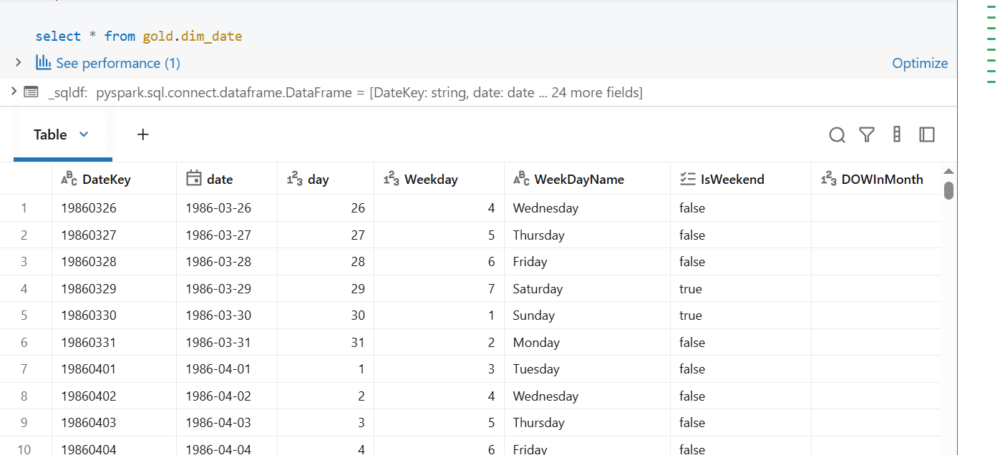
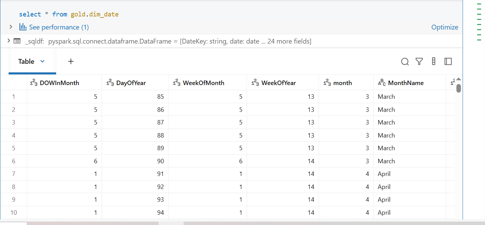
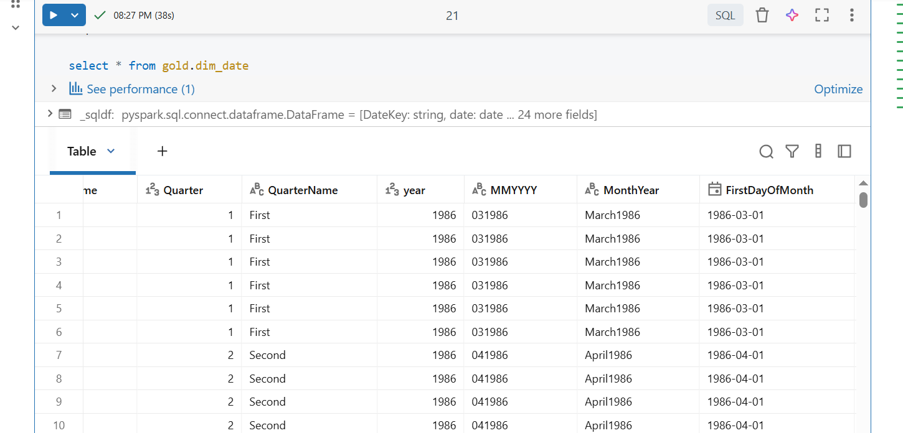

---

## Orders Fact Table

Variables for notebook

```
#Job Parameters
output_schema_name = "gold"
output_table_name = "orders_fact"
table_full_name = f"{output_schema_name}.{output_table_name}"
stage_table_full_name = "silver.orders"
#dimension tables
suppliers_table_full_name = "gold.suppliers"
customers_table_full_name = "gold.customers"
products_table_full_name = "gold.products"
date_table_full_name = "gold.dim_date"
log_schema_name = "log"
log_table_name = 'table_logs'

```

Read data from silver layer into dataframe

```
# Read data from Staging/Silver
df_stg = spark.read.table(stage_table_full_name)

print("SPARK_APP: Staging Data Count - " + str(df_stg.count()))
print("SPARK_APP: Printing Staging Schema --")
df_stg.printSchema()

```

Import libraries

```
from pyspark.sql.functions import current_timestamp, col, expr, to_date, date_format, udf, lit
from pyspark.sql.types import StringType
from datetime import datetime
from delta import DeltaTable
import uuid
import pandas as pd

```

Read surrogate keys from customers, products, dates, and suppliers dimension tables

```
# Read dim tables to join to with Fact
df_dim_customers = spark.read.table(customers_table_full_name).where("active_flg = 1").selectExpr("CustomerID", "skey as customer_skey")

df_dim_products = spark.read.table(products_table_full_name).where("active_flg = 1").selectExpr("ProductID", "skey as product_skey")

df_dim_suppliers = spark.read.table(suppliers_table_full_name).where("active_flg = 1").selectExpr("Supplierid", "skey as supplier_skey")


df_dim_dates = spark.read.table(date_table_full_name).selectExpr("date", "DateKey as date_skey")

```

Add surrogate keys to fact dataframe

```
# Get SURROGATE KEYs from Dimensions and add to Fact table
df_fact = df_stg.join(df_dim_products, how="left_outer", on=df_stg.ProductID == df_dim_products.ProductID).join(df_dim_customers, how="left_outer", on=df_stg.CustomerID == df_dim_customers.CustomerID).join(df_dim_suppliers, how="left_outer", on=df_stg.SupplierId == df_dim_suppliers.Supplierid).join(df_dim_dates, how="left_outer", on=df_stg.LastEditedDate == df_dim_dates.date).select(df_dim_dates.date_skey, df_dim_products.product_skey, df_dim_suppliers.supplier_skey, df_dim_customers.customer_skey, df_stg.OrderID, df_stg.ProductID, df_stg.SupplierId, df_stg.CustomerID, df_stg.Quantity, df_stg.UnitPrice, df_stg.TaxRate, df_stg.LastEditedBy, df_stg.LastEditedWhen, df_stg.LastEditedDate, df_stg.effective_start_dt, df_stg.effective_end_dt, df_stg.active_flg,  df_stg.insert_dt, df_stg.update_dt, df_stg.record_creation_date)

```

Implement functions for data validation, saving to tables, archiving files, creating logs, handling validation success and failures. (ideally these should be in a module or package to share across notebooks)

```
import great_expectations as gx
from great_expectations.core.batch import RuntimeBatchRequest
from pyspark.sql import DataFrame
from pyspark.sql.functions import lit, current_timestamp, col

def validate_gold_with_gx(
    df: DataFrame,
    schema: dict,
    expected_row_count: int = None,
    enable_length_check: bool = True

) -> bool:
    '''
        Input: df (dataframe), schema (dict), expected_row_count (int), enable_length_check (bool)

        Output: True if all expectations pass, False otherwise
    '''
    """
    Runs Great Expectations checks on a Spark DataFrame.
    """
    """
    # 1) Build a transient GX context and Spark datasource
    context = gx.get_context()
    ds = context.data_sources.add_spark(name="spark_in_memory")
    asset = ds.add_dataframe_asset(name="df_asset")
    batch_def = asset.add_batch_definition_whole_dataframe("df_batch")
    batch = batch_def.get_batch(batch_parameters={"dataframe": df})
    """
    # 1) Build a transient GX context and Pandas datasource
    context = gx.get_context()
    datasource = context.data_sources.add_pandas(name="pandas_datasource")
    name = "df_dataframe"
    data_asset = datasource.add_dataframe_asset(name=name)
    batch_definition_name = "df_batch"
    batch_definition = data_asset.add_batch_definition_whole_dataframe(
    batch_definition_name
    )
    batch_parameters = {"dataframe": df}

    # Get the dataframe as a Batch
    batch = batch_definition.get_batch(batch_parameters=batch_parameters)


    from great_expectations import expectations as E
    results = []
    ordered_cols = []

    # 2) Table-level expectations
    for col, props in schema.items():
        ordered_cols.append(col)

        if props.get("unique", False):
            results.append(batch.validate(E.ExpectColumnValuesToBeUnique(column=col)))
        if props.get("nullable", True) is False:
            results.append(batch.validate(E.ExpectColumnValuesToNotBeNull(column=col)))

        dtype = props.get("dtype")
        if dtype:
            results.append(batch.validate(E.ExpectColumnValuesToBeOfType(column=col, type_=dtype)))

        if enable_length_check:
            size = props.get("size")
            if size is not None:
                results.append(
                    batch.validate(
                        E.ExpectColumnValueLengthsToBeBetween(
                            column=col, min_value=None, max_value=int(size), strict_max=True
                        )
                    )
                )


    if expected_row_count is not None:
        results.append(batch.validate(E.ExpectTableRowCountToEqual(value=int(expected_row_count))))
    # 4) Summarize results
    total = len(results)
    successes = sum(1 for r in results if getattr(r, "success", False))
    failures = total - successes
    print(f"[DQ] Expectations run: {total} | Passed: {successes} | Failed: {failures}")
    if failures > 0:
        for r in results:
            if not getattr(r, "success", False):
                cfg = getattr(r, "expectation_config", None)
                etype = getattr(cfg, "type", "unknown") if cfg else "unknown"
                kwargs = getattr(cfg, "kwargs", {}) if cfg else {}
                print(f"[DQ][FAIL] {etype} {kwargs}")
        return False
        #raise Exception("Data Quality validation failed.")
    else:
        print("[DQ] All checks passed ✔️")
        return True

def write_data_to_lakehouse_table(df_name, table_name, schema, log_schema, log_table) -> None:
    ''' Input: df_name  (dataframe), table_name (str), log_schema (str), log_table (str), log_table (str)
    Function: Reads data from CSV file path, adds a record_creation_date field and writes to Lakehouse table.
    Output: None
    '''

    time_now = datetime.now()
    df_name = df_name.withColumn('record_creation_date', lit(time_now))
    df_name.write.format("delta").mode("append").saveAsTable(f"{schema}.{table_name}")

    #log table creation
    log_table_creation(schema, table_name, log_schema, log_table, 'success', time_now)

def log_table_creation(schema, table_name, log_schema, log_table, load_status, time_now) -> None:
    '''
    This function logs the table creation event to a log table
    Input: schema (str), table_name (str), time_now (datetime)
    '''
    log_df = spark.createDataFrame(
        [(schema, table_name, load_status, time_now)],
        ["Schema", "Table_name", "Status", "Created_at"]
    )
    log_df.write.format("delta").mode("append").saveAsTable(f"{log_schema}.{log_table}")


def handle_sucess(df_name, output_table_name, output_table_schema, log_schema, log_table) -> None:
    ''' Function to handle a successful validation run
    Input: df_name (dataframe), output_table_name (str), output_table_schema (str), log_schema (str), log_table (str), archive_path (str)
    This could include:
    1) write file contents to raw lakehouse table
    2) write log to log table
    '''

    # Write file content to lakehouse table and log table
    write_data_to_lakehouse_table(df_name, output_table_name, output_table_schema, log_schema, log_table)


def handle_failure(schema, table_name, log_schema, log_table_name) -> None:
    '''
    Input: schema (str), table_name (str)
    Function to handle a failed validation run
    This could include:
    1) failure logging
    '''
    time_now = datetime.now()

    #log table creation
    log_table_creation(schema, table_name, log_schema, log_table_name, 'failure', time_now)


```

Create schema for data validation

```
# Expect the columns to be from the expected column set
spark_expected_schema = {
    "date_skey": {"size": 255, "dtype": "StringType","unique": False, "nullable": False},
    "product_skey": {"size": 255, "dtype": "StringType","unique": False, "nullable": False},
    "supplier_skey": {"size": 255, "dtype": "StringType","unique": False, "nullable": False},
    "customer_skey": {"size": 255, "dtype": "StringType","unique": False, "nullable": True},
    "OrderID":         {"size": None, "dtype": "IntegerType",  "unique": True,  "nullable": False},
    "ProductID":       {"size": 255,  "dtype": "IntegerType",   "unique": False, "nullable": False},
    "SupplierId":       {"size": 255,  "dtype": "IntegerType",   "unique": False, "nullable": False},
    "CustomerID":       {"size": 15,  "dtype": "IntegerType",   "unique": False, "nullable": False},
    "Quantity":       {"size": 15,  "dtype": "IntegerType",   "unique": False, "nullable": False},
    "UnitPrice":       {"size": 100,  "dtype": "FloatType",   "unique": False, "nullable": False},
    "TaxRate":       {"size": 150,  "dtype": "FloatType",   "unique": False, "nullable": False},
    "LastEditedBy":       {"size": 100,  "dtype": "IntegerType",   "unique": False, "nullable": False},
    "LastEditedWhen":       {"size": 100,  "dtype": "StringType",   "unique": False, "nullable": False},
    "LastEditedDate":       {"size": 25,  "dtype": "StringType",   "unique": False, "nullable": True},
    "effective_start_dt": {"size": None, "dtype": "TimestampType","unique": False, "nullable": False},
    "effective_end_dt": {"size": None, "dtype": "TimestampType","unique": False, "nullable": True},
    "active_flg": {"size": 1, "dtype": "IntegerType","unique": False, "nullable": False},
    "insert_dt": {"size": None, "dtype": "TimestampType","unique": False, "nullable": True},
    "update_dt": {"size": None, "dtype": "TimestampType","unique": False, "nullable": False},
    "record_creation_date": {"size": None, "dtype": "TimestampType","unique": False, "nullable": True}
}

panda_expected_schema = {
    "date_skey": {"size": 255, "dtype": "object","unique": False, "nullable": False},
    "product_skey": {"size": 255, "dtype": "object","unique": False, "nullable": False},
    "supplier_skey": {"size": 255, "dtype": "object","unique": False, "nullable": False},
    "customer_skey": {"size": 255, "dtype": "object","unique": False, "nullable": True},
    "OrderID":         {"size": None, "dtype": "int32",  "unique": True,  "nullable": False},
    "ProductID":       {"size": 255,  "dtype": "int32",   "unique": False, "nullable": False},
    "SupplierId":       {"size": 255,  "dtype": "int32",   "unique": False, "nullable": False},
    "CustomerID":       {"size": 15,  "dtype": "int32",   "unique": False, "nullable": False},
    "Quantity":       {"size": 15,  "dtype": "int32",   "unique": False, "nullable": False},
    "UnitPrice":       {"size": 100,  "dtype": "float32",   "unique": False, "nullable": False},
    "TaxRate":       {"size": 150,  "dtype": "float32",   "unique": False, "nullable": False},
    "LastEditedBy":       {"size": 100,  "dtype": "int32",   "unique": False, "nullable": False},
    "LastEditedWhen":       {"size": 100,  "dtype": "datetime64",   "unique": False, "nullable": False},
    "LastEditedDate":       {"size": 25,  "dtype": "datetime64",   "unique": False, "nullable": True},
    "effective_start_dt": {"size": None, "dtype": "datetime64","unique": False, "nullable": False},
    "effective_end_dt": {"size": None, "dtype": "datetime64","unique": False, "nullable": True},
    "active_flg": {"size": 1, "dtype": "int32","unique": False, "nullable": False},
    "insert_dt": {"size": None, "dtype": "datetime64","unique": False, "nullable": True},
    "update_dt": {"size": None, "dtype": "datetime64","unique": False, "nullable": False},
    "record_creation_date": {"size": None, "dtype": "datetime64","unique": False, "nullable": True},
}

```

Perform schema validation

NB. Convert Spark dataframe to Pandas dataframe to carry out validation (only needed because we are using a serverless compute from Databricks)

```
df_dim_temp1 = df_fact

#Get count of orders
expected_rows = df_fact.count()

p_df = df_dim_temp1.toPandas()

validated = validate_gold_with_gx(
    df=p_df,
    schema=panda_expected_schema,
    expected_row_count=expected_rows,
    enable_length_check=False
)

```

Validation results
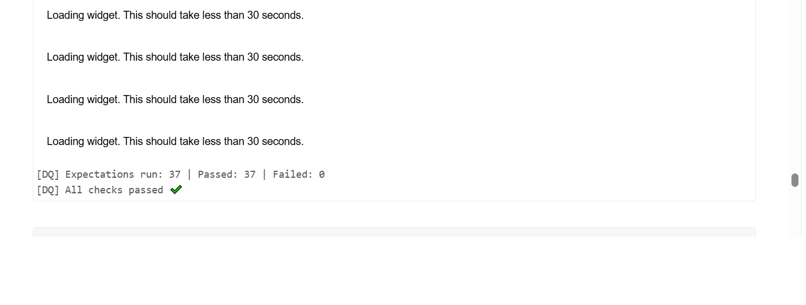

If schema is validated, save data to table, and create a success log in log table, otherwise create a failure log in log table

```

# Read data from landing based on max timestamp
if validated:

    handle_sucess(df_fact, output_table_name, output_schema_name, log_schema_name, log_table_name)

else:
    handle_failure(output_table_name, output_schema_name, log_schema_name, log_table_name)

```

Output

