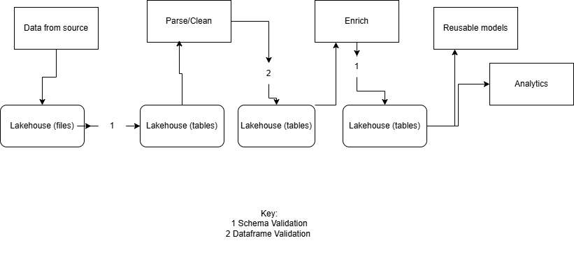

In this section we implement the Extract Transform Load (ETL) need for the data we will use for the reporting and analysis sections.

This project was implemented on the free version of Databricks so it contains some workaround for serverless computing. Also, the dataset used has some shortcoming and some assumptions were made. These will be identified in the appropiate sections.

<h3> This project used PySpark and SQL languages on Databricks and the Great Expectations Python Library for data and schemas validations </h3>

The ETL process will go the the medallion architecture with validation executed at each stage to ensure data quality as the data move through each stages of the pipeline.

The process is illustrated as follows:

**The archictectural layers** 
In the bronze layer:

1. incoming data is checked for corrupted records and the corrupted records are stored separately for inspection and correction.
2. The dataframe is validated for expected records count and the ordering of columns
3. Validated dataframe data are stored, incoming files are archived and a record log is created
4. Invalidated dataframe are not stored and record log is created

In the silver layer:

1. New or updated records are read from the bronze layer into a dataframe
2. The data is de-duplicated.
3. The data is validated for nulls, correct date formats, records count, uniqueness, valid date ranges, format verification (including emails) verification, import column exists
4. Audit and Slowly Changing Dimension columns are added
5. Validated dataframe data are stored, incoming files are archived and a record log is created
6. Invalidated dataframe are not stored and record log is created

In the Gold layer:

1. Records are read from the silver layer into a dataframe
2. Surrogate keys and hash columns are added to the data
3. The dataframe is validated for expected records count and the ordering of columns (This is to verify surrogate keys and hash columns are a part of the new schema)
4. Implement Slowly Changing Dimension (SCD) type 1 and type 2 logics.

Next steps:
Create orchestration pipelines to automate the notebooks and implement monitoring measures to quickly respond to failures.
