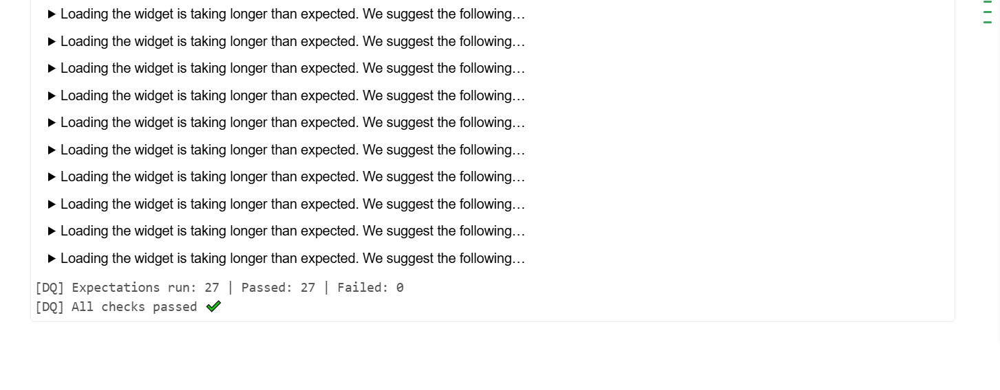
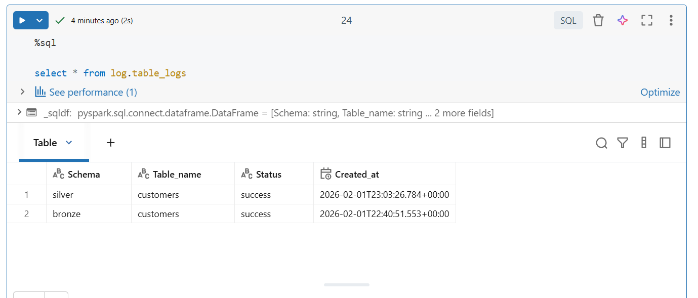

<h2>In this silver layer we start by setup up global variables in the notebooks which will be referenced throughout the notebooks.</h2>

<b>We use PySpark for implementing this stage and the Great Expectations Python Library for data validations.</b>

The implementation steps are as follows:

Variables setup

```
#Job Parameters
output_schema_name = "silver"
output_table_name = "customers"
table_full_name = f"{output_schema_name}.{output_table_name}"
landing_table_full_name = "bronze.customers"
log_schema_name = "log"
log_table_name = 'table_logs'
```

Get max date to process only new or changed data in this stage

```
from datetime import datetime

# Get the max_timestamp for data load in staging
# Read data from landing based on max timestamp
df = spark.read.table(f"{log_schema_name}.{log_table_name }")
row1 = df.where(f"Table_name = '{output_table_name}' and schema = '{output_schema_name}'").groupBy("Table_name").agg({"Created_at": "max"}).first()

if row1 is None:
    max_timestamp = datetime(1900, 1, 1)
else:
    max_timestamp = row1[1]
print("SPARK_APP: Max timestamp for staging data load - " + str(max_timestamp))
```

Use max date to bring in new or changed data

```
# Read data from landing based on max timestamp
df_ld = spark.read.table(landing_table_full_name).where(f"record_creation_date > '{max_timestamp}'")

print("SPARK_APP: Landing Data Count - " + str(df_ld.count()))
print("SPARK_APP: Printing Landing Schema --")
df_ld.printSchema()
```

Key imports

```
from pyspark.sql.functions import current_timestamp, expr, to_timestamp
```

Remove any duplicates

```
# De-dupe the data based on NK
df_dedupe = df_ld.withColumn("_rnk", expr(f"row_number() over (partition by CustomerID order by record_creation_date desc)")).where("_rnk = 1").drop("_rnk")

print("SPARK_APP: Landing Data Count after de-dupe - " + str(df_dedupe.count()))
```

Install Great Expectations (Ideally this should be installed in a shared environment used by all notebooks)

```
%pip install --q great_expectations
```

Implement functions for data validation, saving to tables, archiving files, creating logs, handling validation success and failures. (ideally these should be in a module or package to share across notebooks)

```

import great_expectations as gx
from pyspark.sql import DataFrame
from datetime import datetime
from pyspark.sql.functions import lit, current_timestamp, col

def validate_silver_with_gx(
    df: DataFrame,
    column_not_to_be_null: list,
    column_match_date_format: list,
    column_expected_row_count: int = None,
    to_be_unique: list = None ,
    column_value_to_exist: list = None ,
    column_value_to_be_between: list = None,
    column_value_to_match: list = None
) -> bool:
    ''' Function to validates input dataframe against a schema using Great Expectations.
    Input: df (dataframe), column_not_to_be_null (list), column_match_date_format (list), column_expected_row_count (int), to_be_unique (list), column_value_to_exist (list), column_value_to_be_between (list), column_value_to_match (list)
    Output: bool
    '''

    """
    Runs Great Expectations checks on a Spark DataFrame.
    """
    """
    # 1) Build a transient GX context and Spark datasource
    context = gx.get_context()
    ds = context.data_sources.add_spark(name="spark_in_memory")
    asset = ds.add_dataframe_asset(name="df_asset")
    batch_def = asset.add_batch_definition_whole_dataframe("df_batch")
    batch = batch_def.get_batch(batch_parameters={"dataframe": df})
    """
    # 1) Build a transient GX context and Pandas Dataframe datasource
    context = gx.get_context()
    datasource = context.data_sources.add_pandas(name="pandas_datasource")
    name = "df_dataframe"
    data_asset = datasource.add_dataframe_asset(name=name)
    batch_definition_name = "df_batch"
    batch_definition = data_asset.add_batch_definition_whole_dataframe(
    batch_definition_name
    )
    batch_parameters = {"dataframe": df}

    # Get the dataframe as a Batch
    batch = batch_definition.get_batch(batch_parameters=batch_parameters)


    # 2) Run expectations per not null values
    from great_expectations import expectations as E
    results = []
    for col in column_not_to_be_null:
        results.append(batch.validate(E.ExpectColumnValuesToNotBeNull(column=col)))

    # 3) Run expectations to match date format
    for col in column_match_date_format:
        results.append(batch.validate(E.ExpectColumnValuesToMatchRegex(column=col, regex=r"^\d{4}-\d{2}-\d{2} \d{2}:\d{2}:\d{2}$")))


    # 4) Run expectations to match values to be unique
    for col in to_be_unique:
        results.append(batch.validate(E.ExpectColumnValuesToBeUnique(column=col)))

    # 5) Run expectations to match values to exist
    for col in column_value_to_exist:
        results.append(batch.validate(E.ExpectColumnToExist(column=col)))

    # 6) Run expectations to values to be between
    for col in column_value_to_be_between:
        results.append(batch.validate(E.ExpectColumnValuesToBeBetween(column=col,  min_value=datetime.strptime('1980-01-01', '%Y-%m-%d'), max_value=datetime.now())))

    # 7) Run expectations to match values
    for col in column_value_to_match:
        results.append(batch.validate(E.ExpectColumnValuesToMatchRegex(column=col, regex=r"^[a-zA-Z0-9_.+-]+@[a-zA-Z0-9-]+\.[a-zA-Z0-9-.]+$")))


    # 8) Summarize results
    total = len(results)
    successes = sum(1 for r in results if getattr(r, "success", False))
    failures = total - successes

    print(f"[DQ] Expectations run: {total} | Passed: {successes} | Failed: {failures}")
    if failures > 0:
        for r in results:
            if not getattr(r, "success", False):
                cfg = getattr(r, "expectation_config", None)
                etype = getattr(cfg, "type", "unknown") if cfg else "unknown"
                kwargs = getattr(cfg, "kwargs", {}) if cfg else {}
                print(f"[DQ][FAIL] {etype} {kwargs}")
        return False
        #raise Exception("Data Quality validation failed.")
    else:
        print("[DQ] All checks passed ✔️")
        return True


def write_data_to_lakehouse_table(df_name, table_name, schema, log_schema, log_table) -> None:
    ''' Input: df_name  (dataframe), table_name (str), log_schema (str), log_table (str), log_table (str)
    Function: Reads data from CSV file path, adds a record_creation_date field and writes to Lakehouse table.
    Output: None
    '''

    time_now = datetime.now()
    df_name = df_name.withColumn('record_creation_date', lit(time_now))
    df_name.write.format("delta").mode("append").saveAsTable(f"{schema}.{table_name}")

    #log table creation
    log_table_creation(schema, table_name, log_schema, log_table, 'success', time_now)

def log_table_creation(schema, table_name, log_schema, log_table, load_status, time_now) -> None:
    '''
    This function logs the table creation event to a log table
    Input: schema (str), table_name (str), time_now (datetime)
    '''
    log_df = spark.createDataFrame(
        [(schema, table_name, load_status, time_now)],
        ["Schema", "Table_name", "Status", "Created_at"]
    )
    log_df.write.format("delta").mode("append").saveAsTable(f"{log_schema}.{log_table}")


def handle_sucess(df_name, output_table_name, output_table_schema, log_schema, log_table) -> None:
    ''' Function to handle a successful validation run
    Input: df_name (dataframe), output_table_name (str), output_table_schema (str), log_schema (str), log_table (str), archive_path (str)
    This could include:
    1) write file contents to raw lakehouse table
    2) write log to log table
    '''

    # Write file content to lakehouse table and log table
    write_data_to_lakehouse_table(df_name, output_table_name, output_table_schema, log_schema, log_table)


def handle_failure(schema, table_name, log_schema, log_table_name) -> None:
    '''
    Input: schema (str), table_name (str)
    Function to handle a failed validation run
    This could include:
    1) failure logging
    '''
    time_now = datetime.now()

    #log table creation
    log_table_creation(schema, table_name, log_schema, log_table_name, 'failure', time_now)
```

Perform data validation on dataframe, including, null checks, date format checks, records count check, uniqueness check, column existence checks, dates between checks and email validation checks.

next steps: greater than 0 checks

NB. Convert Spark dataframe to Pandas dataframe to carry out validation (only needed because we are using a serverless compute from Databricks)

```
#Create a dataframe to hold customers' data
p_customers_df = df_dedupe.withColumn('ValidTo', lit('2030-01-01 00:00:01')).withColumn("ValidTo", to_timestamp(col("ValidTo"), "yyyy-MM-dd HH:mm:ss"))
p_df = p_customers_df.toPandas()


# TO USE WITH A COMPUTE CONFIGURATION
validated = validate_silver_with_gx(
    df=p_df,
    column_not_to_be_null = ['CustomerID','PhoneNumber','FaxNumber','Email','Address','City','State','Zip','Country','ValidFrom','ValidTo'],
    column_match_date_format = ['ValidFrom','ValidTo'],
    column_expected_row_count  = expected_rows,
    to_be_unique = ['CustomerID'] ,
    column_value_to_exist = ['CustomerID','PhoneNumber','FaxNumber','Email','Address','City','State','Zip','Country','ValidFrom','ValidTo'] ,
    column_value_to_be_between =  ['ValidFrom'],
    column_value_to_match = ['Email']
)
```

Validation results


Add audit and SCD type 2 columns

```
# Add audit columns
df_stg = df_dedupe.withColumns({"effective_start_dt": current_timestamp(), "effective_end_dt": to_timestamp(lit("2100-12-31 00:00:00.000000")),"active_flg": lit(1), "insert_dt": current_timestamp(), "update_dt": current_timestamp() }) \
    .drop("record_creation_date").drop("ValidFrom").drop("ValidTo")

df_stg.printSchema()
```

If data is validated, save data to table and create a success log in log table, otherwise create a failure log in log table

```
# Read data from landing based on max timestamp
if validated:
    df = spark.read.table(f"{log_schema_name}.{log_table_name}")
    row1 = df.where(f"Table_name = '{output_table_name}' and schema = '{output_schema_name}'").groupBy("Table_name").agg({"Created_at": "max"}).first()
    if row1 is None:
        max_timestamp = datetime(1900, 1, 1)
    else:
        max_timestamp = row1[1]

    row2 = df_stg.agg({"insert_dt": "max"}).first()
    max_timestamp2 = row2[0]
    if max_timestamp2 > max_timestamp:
        handle_sucess(df_stg, output_table_name, output_schema_name, log_schema_name, log_table_name)

else:
    handle_failure(output_table_name, output_schema_name, log_schema_name, log_table_name)
```

Log output


Data output


This process is repeated for the suppliers, products and orders data
