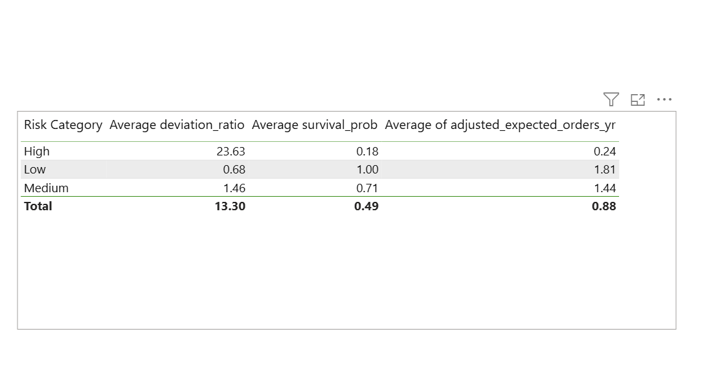

This project uses segmentation, migration, and part-to-whole analysis to understand the drivers of revenue and predict customer churn at the **MNO** retailer store. It identifies behavioral and demographical features that influence whether a customer is likely to churn, and supports organizations
in developing targeted retention strategies.

Tools: Pyspark, datatables, SQL, and Power BI
SQL script can be found in the scripts section.
Pyspark code in the ETL section

**MNO** is a general e-commerce company selling a variety of goods and accessories to global clients. Established in 2000, it has expanded in the last few years. With a constant growth in the e-commerce space, it is encountering increasing competition from peer companies.

**MNO** has 10000 customers, thousand of transactions, and revenue amounting to over half a billion dollars. The e-commerce data span, various dimensions and metrics
including, country, revenue, revenue by brand, revenue by country, and customer segmentation.

Upon the request of the operation head, an in-depth analysis was conducted over the past several years (2000-2018). This review provides valuable insights that can be utilized by internal cross-functional teams to streamline performance to meet the organization's goals.

**Metrics**
Revenue Trends - Orders revenue, number of orders, and Average order Value (AVO)  
Product Performance - analyze product and brand lines  
Customer behaviour - analyze customers across segments 
Regional results - evaluate regional demand and product performance to identify areas for improvement 

**Products Segments**
Products were segmented as follows to assist with analysis: 
&nbsp;&nbsp;&nbsp;&nbsp; - total revenue greater than $50,000 'High Performer'  
&nbsp;&nbsp;&nbsp;&nbsp;- total revenue greater than $20,000, but less than $50,000 'mid-range' - total revenue less than or equal to $20,000 'low Performer'  

**<b>Summary </b>**
 
Year over Year Revenue

 

Year over Year order Brand Revenue

 

Year over Year order counts

Overall Revenue by Brand
 

 

**Revenue Growth and Peak Performance** 
&nbsp;&nbsp;&nbsp;&nbsp;- 2022 was the strongest year with revenue of 28.5M, with revenue fluctuating throughtout the years. 
&nbsp;&nbsp;&nbsp;&nbsp;- In 2002, QuaPure, ChefChoice, PeakPerformance and SoundWave were our key revenue drivers with revenue of ~ $3.2M, $3.1M, $3M and $3M respectively. 
&nbsp;&nbsp;&nbsp;&nbsp;- ChefChoice is our all-time best performing brand with revenue totalling $57.4M - 2015 was another good year with revenue totalling $28.3M 

Revenue by Brand (2013-2014)

 
**Decline in 2014** 
&nbsp;&nbsp;&nbsp;&nbsp;- Revenue decline in 2014, but not significantly. 
&nbsp;&nbsp;&nbsp;&nbsp;- Between the period Jan 1, 2013 to Jan 1, 2015, StyleCo revenue dropped from approimately $3.7M to $2.5M (~48%), UrbanStyle dropped from $3.1M to $2.6M (~19%), TechGear dropped from $3M to $2.2M (~36%), HomeComfort dropped from ~2.6M to 2M (~30%)
 

**Order Count** 
&nbsp;&nbsp;&nbsp;&nbsp;- Order counts follow revenue. Like revenue, orders fluctuates during the period with no major dips with the lowest total orders of 9.6M in 2014 
&nbsp;&nbsp;&nbsp;&nbsp;- Total order dropped by 8% between 2013 to 2014 
&nbsp;&nbsp;&nbsp;&nbsp;- While 2002, 2009, 2015 have approximately the same amount of total orders, the annual revenue is not the same which would indicated that order values were higher in 2002 than in the other years. 

**Recommendation**  
-&nbsp;&nbsp;&nbsp;&nbsp; Thoroughly investigate causes of 2014 decline (eg. competition, market changes, internal, other factors )  
&nbsp;&nbsp;&nbsp;&nbsp;- Leverage high performing years to refine marketing and sale strategies  
&nbsp;&nbsp;&nbsp;&nbsp;- Reasses strategies for coming years focusing on promotions, pricing and customer engagements  

Revenue by Country

**Product Segment and Country performance** 
&nbsp;&nbsp;&nbsp;&nbsp;- Every country contributes less than 1% of revenue;however, Tonga and Turkey contibution is less than 0.3% 
&nbsp;&nbsp;&nbsp;&nbsp;- The low performing product segment revenue is less than half of the other two segments, but has the most customers purchases which would indicate most customers buy the cheaper products. 

Dataset Structure and ERD (Entity Relation Diagram)

 

**Customers Segments** 
customers were segmented as follows to assist with analysis: 
&nbsp;&nbsp;&nbsp;&nbsp; - lifespan in months >=12 and total revenue greater than $10,000 then 'Loyal Customer' 
&nbsp;&nbsp;&nbsp;&nbsp; - lifespan in months >=12 and total revenue less than $10,000 then 'regular Customer' 
&nbsp;&nbsp;&nbsp;&nbsp; - lifespan in months < 12 'New Customer' 

customers were segmented as follows to assist with RFM (Recency, Frequency, Monetary) analysis: 
&nbsp;&nbsp;&nbsp;&nbsp; - Recency - days since last purchase 
&nbsp;&nbsp;&nbsp;&nbsp; - Frequency - total orders placed 
&nbsp;&nbsp;&nbsp;&nbsp; - Monetary - total spend 

Each customer were place in one of 5 groups based on the the recency, fequency and their total spend. 1 being the lowest and 5 the highest.
The customers were then segmented as follows: 
&nbsp;&nbsp;&nbsp;&nbsp; - Frequency: 5, Recency: 5, Monetary 5: - VIP 
&nbsp;&nbsp;&nbsp;&nbsp; - Frequency: 4, Recency: 4 - Loyal 
&nbsp;&nbsp;&nbsp;&nbsp; - Frequency: 1, Recency: 5, - New 
&nbsp;&nbsp;&nbsp;&nbsp; - Recency < 2 - At-risk 
&nbsp;&nbsp;&nbsp;&nbsp; - Anything else - Other 

For churn analysis the customers were segmented as follows: 
&nbsp;&nbsp;&nbsp;&nbsp; - Frequency > 4, Recency > 4, Monetary 5: - VIP 
&nbsp;&nbsp;&nbsp;&nbsp; - Frequency >= 4, Recency < =2 - At-risk Giants 
&nbsp;&nbsp;&nbsp;&nbsp; - Frequency <= 2, Recency >=4 , - Promising new customer 
&nbsp;&nbsp;&nbsp;&nbsp; - Anything else - regular 

We calculated a deviation score by dividing the days since the last customer purchase by their average purchase gap. 

&nbsp;&nbsp;&nbsp;&nbsp; - Average purchase gap = days between first and last order divided by total orders 

We calculated the risk as follows:  
 We use a ratio of Current Silence / Typical Gap (deviation score).

&nbsp;&nbsp;&nbsp;&nbsp; - Score 0-1.0: Behavior is normal (active). 
&nbsp;&nbsp;&nbsp;&nbsp; - Score > 1.5: Customer is "overdue" and likely drifting (slipping). 
&nbsp;&nbsp;&nbsp;&nbsp; - Score > 3.0: High probability of churn (lapsed). 

**<b>Summary </b>** 

Customer Revenue by Product segment

Revenue by Product segment

customers by product segment

 

**Customer Behaviour - Best and Worst** 
&nbsp;&nbsp;&nbsp;&nbsp; - Best performing segment is Loyal customers ($443.4M) and worst segment is Regular with $3.5M. 
&nbsp;&nbsp;&nbsp;&nbsp; - Worst performing segment is VIP customers, which is approximately 100 customers 
&nbsp;&nbsp;&nbsp;&nbsp; - At-risk and unclassified segments has the most customers of approximately 4000.

Customer migration

Customer order prediction

Customer churn prediction

 

&nbsp;&nbsp;&nbsp;&nbsp; -In the last 6 months of 2018 there has been no change in status of 3 at-risk customers (retention at a critical state), 232 customers moved from at risk status to standard/regular (re-activated), and 276 customers moved from regular/standard to at-risk (churn warning) 
&nbsp;&nbsp;&nbsp;&nbsp; - High risk customers are likely to place 0 order over the next year, while medium and low risk customers are likely to buy 1 and 2 products respectively over the next year. 
&nbsp;&nbsp;&nbsp;&nbsp; - Approimately half of the customers across segments are in a lapsed(critical) state, and ~ 28% of customers across segment are in a slipping(warning) state. 

**Recommendations** 
&nbsp;&nbsp;&nbsp;&nbsp;- Constantly push promotions to loyal customers to keep them engaged. 
&nbsp;&nbsp;&nbsp;&nbsp;- Push engagement and promotion campaigns to re-active at-risk customers, offer promotions to regular/standard customers to upsell them to loyal. 
&nbsp;&nbsp;&nbsp;&nbsp;- Offer promotions to at-risk customers increase orders demand and reduce future sales and revenue decline. 
&nbsp;&nbsp;&nbsp;&nbsp;- Immediate actions (a possible win-back campaign) should be taken to re-active At-risk giant customers since these customers represent high frequency and monetary value. We should engage with customers in the slipping state to prevent them from moving to the lapsed state by offering them tailored offers. 

**<b>Recommendations </b>** 
&nbsp;&nbsp;&nbsp;&nbsp;- Finance and analytics teams should investigate the main drivers for low revenue in 2011 and 2014 - which brands, products, or region. 
&nbsp;&nbsp;&nbsp;&nbsp;- Marketing team should push more promotions and marketing strategies for mid and high performing products. 
&nbsp;&nbsp;&nbsp;&nbsp;- Marketing team should developed focused targeted promotions for slipping and lapsed customers to re-active them.  

**Caveats and Assumptions** 

- The LastEditWhen field is the order date and time of products

**Next steps** 

- A shorter period for analysis should be considered with fewer products to conduct depper analysis over months.
- Countries should be group by continent to strengthened regional analysis.
